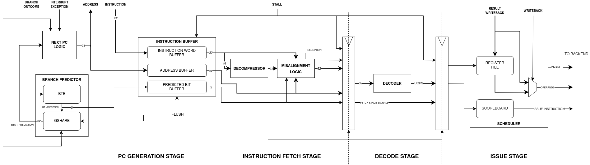
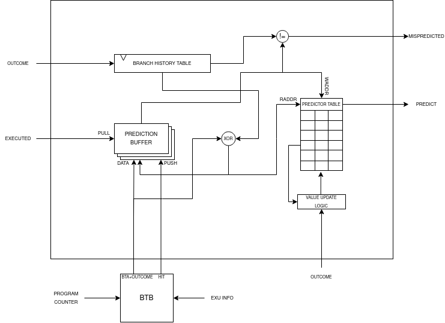
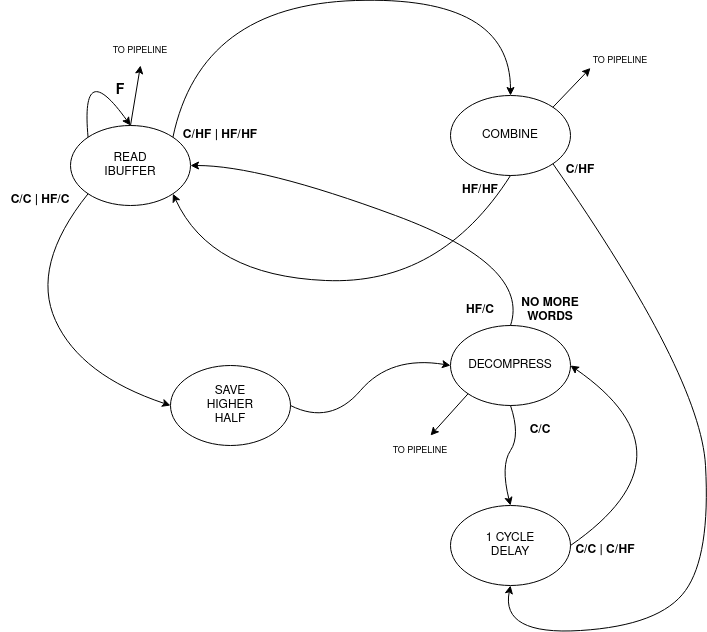

Frontend
=========

The **frontend** is the CPU layer that is responsible for the initial stages of instruction processing, it feeds the execution units with instruction data and commands. To serve this purpouse, the frontend must 
execute different complex tasks: 

* **Instruction Fetch**: Retrieves instructions from memory and places them into the instruction buffer for further processing.
* **Manage Misaligned Instructions**: Manage all the cases of an instruction word being misaligned.
* **Instruction Decompression**: In case of a compressed instruction, it gets expanded into its 32 bit version.
* **Instruction Decoding**: The instruction gets decoded into multiple commands. 
* **Next PC Decision**: The frontend determine the next PC based on branch predictor decisions and signals that comes from the *backend*. 
* **Issue Scheduling**: To support coherency during program execution, due to the pipelined and OoO nature of the CPU core, instructions that get issued must be scheduled.

PC Generation Stage 
-------------------

During this stage, the *next PC gets determined* based on several signals / events and the valid instructions get *written into the instruction buffer*.

Next PC Logic 
~~~~~~~~~~~~~

*To determine the next PC* the combinational logic uses signals coming from: **outside the core**, **execution unit**, **writeback stage** and **predictor unit**. If no particular event is detected, the **PC advances by 4**. Events obiously have different priorities:

.. list-table:: Next PC Events (High to Low priority)
   :widths: 25 30
   :header-rows: 1

   * - Name 
     - Description
   * - **Exception** 
     - Exception detected during *writeback*, PC gets loaded with the **mtvec** value.
   * - **Interrupt** 
     - External interrupt detected, PC gets loaded with the **mtvec** value.
   * - **Handler Return** 
     - **MRET** Instruction executed, this is detected during *writeback*, PC gets loaded with the **mepc** value.
   * - **Branch Executed** 
     - The execution unit has executed a branch, PC gets loaded with the *branch target address*.
   * - **Instruction Buffer not Full** 
     - PC gets incremented by 4.

These are the main events that can happen during program runtime. But how are predicted branches? How a misprediction is detected?

When a **branch is executed** during execution stage, first of all the logic checks if that branch is **speculative or not** (so if that branch was predicted or not). If it's speculative, checks if the 
**branch predictor** has *detected a misprediction* or the branch was *correctly predicted*. If it's mispredicted, the PC gets loaded with the branch target address (or incremented if the branch was not taken), otherwise 
the execution continues normally. 

During **normal execution** (if the buffer is not full), the logic always checks if *there's a branch target buffer hit*, if a BTA hit is registred and the branch is taken, the PC is loaded with the 
predicted BTA, otherwise the PC is simply incremented.

This is the SystemVerilog code that implements the combinational logic: 

.. code-block:: systemverilog

    if (exception_i | interrupt_i) begin
        fetch = 1'b1;

        PC = handler_pc_i; 
    end else if (handler_return_i) begin 
        fetch = 1'b1;

        PC = hander_return_pc_i; 
    end else if (executed_i) begin
        fetch = 1'b1;

        if (speculative_i) begin
            if (mispredicted) begin 
                if (taken_i | jump_i) begin
                    PC = branch_target_addr_i;
                end else begin
                    PC = compressed_i ? (instr_address_i + 2) : (instr_address_i + 4); 
                end
            end else begin
                fetch = !ibuffer_full; 

                if (branch_buffer_hit & predict) begin
                    PC = branch_target_address;
                end else begin
                    PC = next_program_counter;
                end
            end
        end else begin
            if (taken_i | jump_i) begin 
                PC = branch_target_addr_i;
            end else begin
                fetch = !ibuffer_full; 

                if (branch_buffer_hit & predict) begin
                    PC = branch_target_address;
                end else begin
                    PC = next_program_counter;
                end
            end
        end
    end else if (!ibuffer_full) begin 
        fetch = 1'b1;

        if (branch_buffer_hit & predict) begin
            PC = branch_target_address;
        end else begin
            PC = next_program_counter;
        end
    end 

If none of those conditions is satisfied, the fetch unit won't send a request. As seen if no event makes the PC jump, the logic checks always the branch predictor status:

.. code-block:: systemverilog

    if (branch_buffer_hit & predict) begin
        PC = branch_target_address;
    end else begin
        PC = next_program_counter;
    end

Branch Predictor 
~~~~~~~~~~~~~~~~

The **branch predictor** plays a critical role in enhancing the efficiency of program execution by anticipating the outcomes of branching instructions during program execution to avoid waiting to know the outcome of the branch.
This function is *particularly valuable for CPU with deep pipes and long fetch latencies*, without a branch predictor if a branch is taken, to start executing the new instruction, the CPU needs to wait *N* clock cyles from the 
branch's to its execution plus *M* clock cycles to wait the new instruction arrival. ApogeoRV's branch predictor is composed by two hardware blocks: **Branch Target Buffer** and 
**GShare Branch Predictor**.

The **Branch Target Buffer**, or **BTB**, essentially operates as a cache, built from syncronous memory with a single read and a single write port. Its primary function is to retain the branch target address associated with specific branch instructions. It's read-indexed by the lower bits of the current PC and just like a cache a BTB entry is composed by 
a *valid bit* to know if the entry has been written with valid data, a *tag* that holds the upper bits of the branch instruction address and the *branch target address*.

.. code-block:: systemverilog

    localparam LOWER_BITS = $clog2(BUFFER_SIZE);

    typedef struct packed {
        logic valid;
        logic [31:LOWER_BITS + 1] tag;
        data_word_t branch_target_address;
    } branch_target_buffer_t;

The BTB is updated with information from the current instruction in the execution unit if that instruction represents a branch or jump. A **BTB Hit** is registered when the upper portion of the *current program counter matches the tag, and the entry is marked as valid*.

The **GShare Branch Predictor** operates as a **global branch predictor** which means that the predictions are based on the history of the most recent the branches. The branch history is saved in a shift register called **branch history table**, that shift whenever a branch / jump is executed, it shift in 
a logic 1 when the branch is taken or it's a jump, logic 0 when the branch is not taken. The entire value of the shift register is XORed with the **branch target address** obtained from the BTB forming an index. This is used to access a table of 
2 bits counters, the memory that holds *the value of the counters is updated when a branch / jump is executed*. Based on the value of the specific counter indexed, the branch predictor takes a guess: if the bit 1 of the counter is high then the branch is taken otherwise it's not.
**The predictor makes a prediction whenever the BTB register an hit**, if that's the case, the information of the prediction is saved into a queue awaiting execution and branch resolution. Inside a queue entry it's saved: the *predicted outcome*, the *hashed index* and 
the *branch target address*:

.. code-block:: systemverilog

    typedef struct packed {
        logic prediction; 
        logic [$clog2(TABLE_SIZE) - 1:0] index;
        data_word_t target_address; 
    } predictor_t;

The queue is *pushed on BTB hit* and is subsequently *popped when the execution unit resolve the branch / jump*. During pop operation, the predictor determines whether a misprediction occurred by *comparing the execution unit's outcome with the prediction bit in the queue entry read*. Then it uses the 
index from the entry to update the corresponding counter. If the branch is taken, the counter is incremented otherwise it's decremented.

These two hardware components collaborate closely to predict the next program counter: the fetch unit forwards the PC to the BTB, and if a BTB hit occurs, the predictor makes a preliminary decision, which is subsequently confirmed or refuted during execution.

Instruction Buffer
~~~~~~~~~~~~~~~~~~

The **instruction buffer** *decouples the fetch interface from the pipeline*. The arrival of new instructions and the request of a new instruction from the pipeline advance at different rates. The pipeline has different source of stalls, during this time new instructions can't be executed, 
discarding or stalling the incoming instructions would degrade the overall performance of the CPU. The instruction buffer is the solution, *fetch unit can still supply new instruction while the pipeline is in stall* and by doing this the fetch unit is effectively prefetching new instructions further increasing performance.

The instruction buffer is composed by three sub-buffers: the **address buffer**, the **instruction word buffer** and the **speculative buffer**. Each sub-buffer is written by its own write signal: when a new instruction is fetched, first the fetch address is sent to the memory. The fetch address is the first 
to be written inside its buffer. After one clock cycle, the speculative buffer gets written with the BTB access result and with the prediction done. When the instruction requested arrives (after N cycles), it gets written finally in the instruction word buffer. 

Once all three buffers are written, they are read simultaneoulsy by the fetch stage logic. The buffers have the same write / read frequency, however the writes of the *speculative buffer* are out of phase of 1 clock cycle, and the writes writes of the *instruction word buffer* are out of phase of N clock cycle 
depending on the memory latency.

Instruction Misaligned Manager
~~~~~~~~~~~~~~~~~~~~~~~~~~~~~~

The instruction buffer typically provides a 4-byte word to the pipeline. However, when the **RISC-V C Extension** is enabled, it introduces the possibility of encountering 2-byte instructions. As a result, a word retrieved from the instruction buffer can take on several forms:

1. One full instruction: `F`
2. Two compressed instructions: `C/C`
3. One compressed instruction and the lower half of a full instruction: `HF/C`
4. The upper half of a full instruction and one compressed instruction: `C/HF`
5. The upper half of a full instruction and the lower half of a full instruction: `HF/HF`

.. note:: **F**: Full Instruction, **C/C**: Two Compressed Instructions, **HF/C**: Compressed Instruction on lower half of the entry and Half Full Instruction on upper half, **C/HF**: Half Full Instruction on lower half and Compressed Instruction on upper half of the entry

For the first case, it's straightforward: simply send the word through the pipeline without any modifications. 

In the second case `C/C`, when two compressed instructions are present, delay the read of the instruction buffer by 1 clock cycle (assuming no stalls) and expand the two compressed instructions back-to-back in the pipeline.

The third and fourth cases occur when there is a full-word misalignment, that is when an `HF/C` word is encountered. First, expand the compressed instruction and send it through the pipeline. Simultaneously, save the higher half of the entry in a register (which is the lower 16 bit of the full instruction). In the next cycle, read the instruction buffer entry, which will be a `C/HF` or `HF/HF` word. 
Combine the previously saved instruction's lower half with the new instruction's upper half residing in the low 16 bits of the buffer entry and send the fused word through the pipeline.

In the fifth case, the previous word's upper 16 bits, have been saved: combine it with the new instruction's upper half residing in the low 16 bits of the buffer entry and send the fused word through the pipeline. At the same time, save the upper 16 bits of the buffer entry.

Decompressor
~~~~~~~~~~~~

The **decompressor** simply receives a 16 bit compressed instruction and expand it in the 32 bit equivalent full instruction.

Decode Stage 
------------

Decoder
~~~~~~~

The **decoder** takes a 32 bit instruction as input and generates a set of signals and micro operations that can be used to drive and control the pipeline:

.. list-table:: Generated Signals
   :widths: 20 15 25
   :header-rows: 1

   * - Name 
     - Width
     - Description
   * - **Immediate** 
     - 32 (x2)
     - Immediate value generated directly from the instruction word.
   * - **Immediate Valid** 
     - 1 (x2)
     - The operand is an immediate or a register.
   * - **Base Address Register** 
     - 1
     - Used for branch and memory instructions, select if the base address is a register or an immediate.
   * - **Save Next PC** 
     - 1
     - Used for JAL and JALR instruction where the return address is saved in a register.
   * - **Address Offset** 
     - 32
     - Used for branch and memory instructions, this is the offset that will be added to the base address.
   * - **Fence** 
     - 1
     - Instruction is FENCE.
   * - **Jump** 
     - 1
     - Instruction is a jump.
   * - **Branch** 
     - 1
     - Instruction is a branch.
   * - **Register Source** 
     - 5 (x2)
     - Register source address in register file.
   * - **Register Destination** 
     - 5
     - Register destination address in register file.
   * - **Execution Unit Valid** 
     - Depends On Configuration
     - Select the unit where the instruction must be executed.
   * - **Execution Unit Micro-Operation** 
     - Depends On Configuration
     - Define the operation to execute on the operands inside a specific unit.
   * - **Exception Generated** 
     - 1
     - An exception has been generated.
   * - **Exception Vector** 
     - 5
     - Not only define the exception but also gives important informations for debug and signals generation in writeback stage.

The decoder is composed by 3 sub-decoder to *enable better modularity*. The first is an **integer decoder** used to decode I, M and Zicsr instructions. Then we have a **bit manipulation decoder** and a **floating point decoder** to decode 
respectively *B* and *Zfinx* instructions. The final set of signals will be selected from the decoded that have not generated an exception.

The exception vector is used to debug the core from the writeback stage, detect exceptions and special operations like `WFI`, `MRET` etc.

.. list-table:: Exception Codes
   :widths: 5 40
   :header-rows: 1

   * - Code 
     - Description
   * - 0
     - Instruction address misaligned.
   * - 1
     - Instruction access fault.
   * - 2
     - Illegal instruction.
   * - 3
     - Breakpoint.
   * - 4
     - Load address misaligned.
   * - 5
     - Load access fault.
   * - 6
     - Store address misaligned.
   * - 7
     - Store/AMO access fault.
   * - 8
     - Environment call from U-mode.
   * - 11
     - Environment call from M-mode.
   * - 16
     - Executed `WFI` instruction, used to put core in sleep.
   * - 17
     - Executed `MRET` instruction, used to control next PC logic.
   * - 18
     - Executed *store* instruction, used to debug core.
   * - 19
     - Executed *load* instruction, used to debug core.
   * - 20
     - Executed *branch* instruction, used to debug core.
   * - 21
     - Executed *jump* instruction, used to debug core.
   * - 22
     - Executed *csr* instruction, used to debug core and to update CSRs state.

Issue Stage 
-----------

Scheduler
~~~~~~~~~

The scheduler in a computer's execution pipeline serves several critical functions to ensure the orderly and efficient execution of instructions. These tasks can be broken down into the following key components:

1. **Determine when to issue the instruction**: The scheduler determines the optimal time to issue the instruction for execution, considering various factors such as data availability, dependencies, and hazards.
2. **Reading the operands from the register files**: The scheduler first retrieves the operands required for the instruction from the register files. These operands are identified using the decoded register addresses.
3. **Fowarding the written back result**: To optimize execution, the scheduler checks for situations where a register destination is currently being written back. If there's a match between a register source and a register destination, the value of the register destination is forwarded and used as the value of the matching register source.
4. **Generate a reorder buffer tag**: To support instruction reordering within the reorder buffer (ROB), the scheduler generates a unique reorder buffer tag for each issued instruction. This tag serves as the write address in the ROB and increments with each issued instruction. During branch mispredictions or flushes, the tag is decremented to maintain order consistency.

The scheduler implements a **scoreboard algorithm** to keep track of all the instruction informations while they are in the execution unit. The scheduler is also used to manage data and structural dependencies and to determine the right time to issue an instruction. For each execution unit the following informations are saved:

* Whether the unit is currently executing.
* The register destination.
* The number of clock cycles remaining until a valid result is produced.

Notably, the approach differs for the **load and store unit** which has variable latency. In such cases, it's not possible to predict the remaining time accurately so only the register destination and the current state of the units are saved. 

Since multi-cycles units can't accept a new operation until the end of the previous one, the scheduler straightforwardly retains the relevant information until the operation's completion.

For pipelined units, a more complex approach is adopted it's possible to consider an 
N cycles deep pipelined unit as **N different virtual multi-cycle units of N clock cycles of latency**. A shift register of N bits is used to select the virtual unit, the shift register has only one bit high at any given time and once the bit arrives at the end, it wraps around to the beginning.
When an operation is issued to a pipelined unit, the i-th high bit in the shift register determines which virtual unit's information is loaded and put in *executing* state. In the next clock cycle the high bit is shifted to the left. If the pipeline is not stalled, the remaining time is decremented with each clock cycle.

.. code-block:: systemverilog

    /* Select the unit stage */
    logic [UNIT_LATENCY - 1:0] virtual_unit_select; 

        always_ff @(posedge clk_i `ifdef ASYNC or negedge rst_n_i `endif) begin : selector
            if (!rst_n_i) begin
                virtual_unit_select <= 1'b1;
            end else if (flush_i) begin
                virtual_unit_select <= 1'b1;
            end else if (!stall_i & issue_next_cycle) begin
                if (virtual_unit_select[UNIT_LATENCY - 1]) begin
                    /* Wrap around the shifted bit */
                    virtual_unit_select <= 1'b1;
                end else begin 
                    /* Shift the bit every time an
                     * operation arrives */
                    virtual_unit_select <= virtual_unit_select << 1;
                end 
            end 
        end : selector

    /* Since the unit is pipelined, the scoreboard needs to keep track of every stage */
    logic [UNIT_LATENCY - 1:0] vunit_executing, vunit_raw_hazard, vunit_latency_hazard;
    logic [UNIT_LATENCY - 1:0][31:0] vunit_register_dest;
    logic [UNIT_LATENCY - 1:0][$clog2(UNIT_LATENCY) - 1:0] vunit_count;

    generate genvar i;

        for (i = 0; i < UNIT_LATENCY; ++i) begin 
            always_ff @(posedge clk_i `ifdef ASYNC or negedge rst_n_i `endif) begin : vunit_status_register
                if (!rst_n_i) begin
                    vunit_count[i] <= '0;
                end else if (flush_i) begin
                    vunit_count[i] <= '0;
                end else if (!stall_i) begin 
                    if (issue_next_cycle & virtual_unit_select[i]) begin
                        /* If the current stage counter is selected 
                         * load status */
                        vunit_count[i] <= UNIT_LATENCY;
                    end else if (vunit_count[i] != '0) begin
                        /* Keep decrementing the latency counter until the
                         * unit produces a valid result */
                        vunit_count[i] <= vunit_count[i] - 1'b1;
                    end else begin
                        /* The unit has finished */
                        vunit_count[i] <= '0;
                    end
                end
            end : vunit_status_register

            always_ff @(posedge clk_i `ifdef ASYNC or negedge rst_n_i `endif) begin : vunit_destination_register
                if (!rst_n_i) begin
                    vunit_register_dest[i] <= '0;
                end else if (!stall_i) begin 
                    if (issue_next_cycle & virtual_unit_select[i]) begin 
                        /* Load register in the next cycle if the instruction 
                         * dispatched is being issued in the next cycle */
                        vunit_register_dest[i] <= dest_reg_i;
                    end 
                end
            end : vunit_destination_register

            assign vunit_executing[i] = (vunit_count[i] > 'd1);

            ...

        end 

    endgenerate

If a new operation needs to be issued, for each unit and virtual unit, it's done a **RAW hazard check** and a **latency hazard check**: 

.. code-block:: systemverilog

    assign vunit_raw_hazard[i] = ((src_reg_i[0] == vunit_register_dest[i]) | (src_reg_i[1] == vunit_register_dest[i])) & 
                                        vunit_executing[i] & (vunit_register_dest[i] != '0);

    assign vunit_duplicate_dreg_hazard[i] = (dest_reg_i == vunit_register_dest[i]);

    assign vunit_latency_hazard[i] = (latency == vunit_count[i]) & vunit_executing[i];

For RAW hazard check, each register source in input is checked against every register destination in *every executing unit or virtual unit*. 

To avoid faulty values fowarded, every register destination inside the execution stage must be different: *there must not be instructions with the same register* 
destination. This causes **different instructions with the same destination register to be issued and executed in order**. Let's see an example:

.. code-block:: asm

    MUL x3, x2, x1  # x3 <= x2 * x1 
    NOPs x MUL_LATENCY - 2
    ADD x3, x4, x5  # x3 <= x4 + x5
    ADD x6, x3, x2  # x6 <= x3 + x2 

In this scenario, we have a sequence of instructions involving an `MUL`, a number of random instructions that finish to execute 2 cycles before the `MUL` produces a valid result and an `ADD`. The first `ADD` instruction is issued and completes execution one clock cycle before the MUL. 
At this point, the data dependency is cleared, allowing the scheduler to issue a second `ADD` instruction.
However, an issue arises when the second `ADD` instruction reaches the bypass stage at the same time as the `MUL` produces a valid result. 
From the hardware perspective, since the MUL unit has generated the most recent result, it is forwarded to register x3 for the second `ADD`. 
This behavior introduces a subtle bug in the program because the result from the MUL should not be used by the second `ADD`. 

This problem presents even if there are no instructions between the `MUL` and the first `ADD`. The subsequent instructions (considered that they are all dependent on x3), will first see the correct result of `x3` from the first `ADD`. 
However after the `MUL` finished the execution, the correct value of `x3` will be overwritten by the old result of the `MUL` instruction leading to bugs. This is because the result of the instructions coming from the execution units are 
saved inside the **snapshot registers** inside the pipeline stages where buffers resides (`COM` and `ROB`). This is **effectively a WAW hazard on those non architectural registers**.

Latency hazard checks are done to ensure that *no more than one unit produces a valid result in the same clock cycle* (this is valid for units inside each major processing unit: ITU, LSU, FPU).