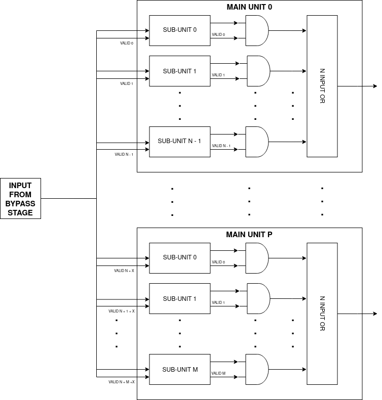
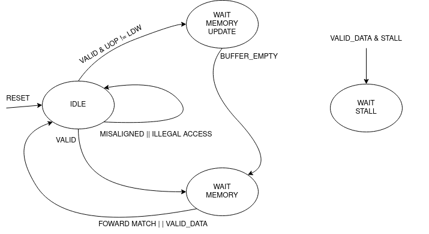
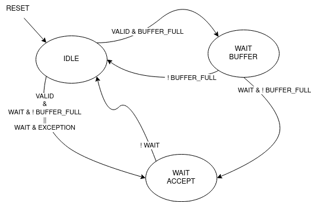

Backend 
=======

The **backend** is the CPU layer where the instructions get actually executed after they have been fetched, decoded and issued by the frontend. 
Here resides all the logic to avoid RAW and WAW data hazards, the execution units that produces the results of the instructions, buffers to avoid structural hazards and the writeback logic. 
Even if the *frontend* and the *backend* are two separate layers, they interact with each other with signals outside the data passed through the pipeline. In particular the backend sends signals to the frontend
to inform it about **stalls** and **pipeline flushes**, during particular conditions.

The backend tasks are:

1. **Resolving RAW data dependencies**: Destination registers of previous instructions are fowarded to the source registers of the curren.
2. **Executing instructions**: Feeds operand and micro-operations to the execution units.
3. **Resolving structural dependencies**: Mutliple unit could produce a valid result at the same time. The reorder buffer has only 1 write port available.
4. **Resolving WAW data dependencies**: The instructions are reordered to be written back in order.
5. **Generating signals to control the pipeline**: Stalling, flushing, signals to advert that specific instructions have been executed etc.

Bypass Stage 
------------

The **bypass stage** is a crucial component in the CPU pipeline, it ensures data coherency and helps to drastically increase performance. Theoretically if one instruction is dependent on another, it should wait until that instruction's result is written back to the register file.
If the instruction is simply issued without any caution, it will read the wrong values from the register file since the correct values are still in the pipeline and not written back. One way to overcome this would be waiting until the instruction write back the result, however this 
would yeld poor performance and also make the use of the pipeline almost useless. 

The bypass stage takes as input the result from instructions residing in the successive stages, and in the eventuality of a register match, it fowards the most recent value. That means that *if there are multiple matches between register destination and 
register source, the one from the most "recent" stage is taken*. The most recent stage is the one logically nearer the bypass stage, for example: `BYP` -> `EXC` -> `COM` -> `ROB` -> `WB` the `EXC` is the most recent out of the stages after `BYP`.
This is simply implemented as a priority multiplexer. **If the source at input is an immediate, the fowarding is not applied!**

.. code-block:: systemverilog

    generate genvar i;  
        
        for (i = 0; i < 2; ++i) begin 

            assign execute_valid[i] = execute_valid_i[i] & !issue_immediate_i[i];
            assign commit_valid[i] = commit_valid_i[i] & !issue_immediate_i[i];
            assign rob_valid[i] = rob_valid_i[i] & !issue_immediate_i[i]; 

            always_comb begin : fowarding_logic 
                casez ({execute_valid[i], commit_valid[i], rob_valid[i]})
                    3'b1??: operand_o[i] = execute_data_i[i];

                    3'b01?: operand_o[i] = commit_data_i[i];

                    3'b001: operand_o[i] = rob_data_i[i];

                    3'b000: operand_o[i] = issue_operand_i[i];

                    default: operand_o[i] = '0;
                endcase 
            end : fowarding_logic
        end

    endgenerate 

As it will be explained later, the stages where buffers resides (`COM` and `ROB`), could have multiple instructions inside waiting to be passed to the next stage. This complicates the designs because the bypass logic should check whether the instruction is valid and if there is a register match,
it could be possible in the case of a small buffer, however in a 64 entries reorder buffer this would just use too many resources and even if this was feasible, the timing here would be terrible. Infact the bypass logic is surely one of the critical paths of the pipeline, so we need to lower the timing at all cost to meet the specifications required on the clock speed. 

To have a better timing / area, 
an ingenious solution is adopted, this method is called **snapshot register**, which is a register file that **holds the future state of the architectural register file**. Along with the register values, also a *valid bit* and a *tag* is saved, those are useful to invalidate the register entries during a 
read to push the instruction foward in the pipeline. To foward the values, the registers source of the instruction in `BYP` stage is sent to a snapshot register, here the value is simply read out of the *asyncronous memory* along with the valid bit.

.. code-block:: systemverilog

    assign foward_register_data = (entry_i.reg_dest == '0) ? '0 : entry_i.result;

        always_ff @(posedge clk_i) begin : register_write_port
            if (write & !stall_i) begin
                for (int i = 0; i < 2; ++i) begin 
                    foward_register[i][entry_i.reg_dest] <= foward_register_data;
                end
            end 
        end : register_write_port

    /* Register the last packet that wrote the foward register */
    logic [5:0] tag_register [31:0];

        always_ff @(posedge clk_i) begin : register_tag_write_port
            if (write & !stall_i) begin
                tag_register[entry_i.reg_dest] <= tag_i;
            end 
        end : register_tag_write_port

    /* Indicates if the result was written back to register file or not */
    logic [31:0] valid_register, valid_out;

    /* Register X0 is always valid */
    assign valid_out = {valid_register[31:1], 1'b1};

        always_ff @(posedge clk_i `ifdef ASYNC or negedge rst_n_i `endif) begin : register_valid_write_port
            if (!rst_n_i) begin
                valid_register <= '0;
            end else if (flush_i) begin 
                valid_register <= '0;
            end else begin
                if (write & !stall_i) begin
                    /* On writes validate the result */
                    valid_register[entry_i.reg_dest] <= 1'b1;
                end 
                
                if (read_i & (tag_register[entry_o.reg_dest] == read_ptr)) begin
                    /* If the instruction that wrote the result in the foward register
                     * is being pulled from the ROB, invalidate the result, but only 
                     * if at the same time there's not the same register being written */
                    if (entry_o.reg_dest != entry_i.reg_dest) begin 
                        valid_register[entry_o.reg_dest] <= 1'b0;
                    end 
                end
            end
        end : register_valid_write_port

The two ifs inside the else branch of `register_valid_write_port` are mutually exclusive, so it's correct to drive `valid_register` inside them.

In this stage also happens the selection of the base address for memory and branch instructions. It's a selection between the first register source and the instruction address. This logic is splitted from the actual address computation to shorten the critical path from the operands fowarding to the addition between the offset and base address.

Execution Stage
---------------

The execution stage contains the four main units where instructions get actually executed. Every unit generally has inside different sub-units to execute different types of instructions, the main units are differentiated from the type of operand and from the type of operations:

* **Integer Unit** (ITU): Perform operations on integer numbers: basic arithmetic, logic, comparisons, bit manipulations...
* **Load Store Unit** (LSU): Execute memory instructions, and handle the memory accesses.
* **Control Status Register Unit** (CSRU): Execute instructions that access the internal status of the CPU, those are CSR instructions specified in the Zicsr extension.
* **Floating Point Unit** (FPU): Perform operations on floating point numbers.

Every main unit has as input:

.. list-table:: Unit Inputs
   :widths: 5 40
   :header-rows: 1

   * - Name 
     - Description
   * - Operands 
     - Operands values read from register file or fowarded.
   * - Valid Unit 
     - Multi bit vector to select a specific sub-unit. Only one bit must be active at any clock cycle. 
   * - Micro-Operation 
     - Specify the operation to perform on one sub-unit.
   * - Instruction Packet 
     - To carry instruction informations along the pipeline.

Some units will have other control inputs, however this is the general interface. All the input listed except for the *valid unit*, drive all the units. So the main units and their sub-units are all connected to the same inputs, the valid unit which has a one-hot behaviour will select the unit 
that need to process the inputs. The micro-operation input is defined as a **union** with the width of the largest micro-operation vector, this to save registers instead of having a different micro-operation for every unit. Each unit will interpret the micro-operation value in its way, so it makes sense to use an union. 

Internally the **main units, will have different output sources**, the ITU will have for examples 4 different sub-units that could produce a valid result at any given time. First of all at every clock cycle, **maximum 1 unit must produce a valid result**; this is done thanks to the scheduler in the frontend. 
The sub-units that didn't output a valid result, will have the output nets set to all zeros, thanks to this it's possible to OR all the output sources from the sub-units to produce a single output for the main-unit.

Each main unit can produce an independent valid output, so at every clock cycle there may be 4 different main units that produce a valid result. 

Integer Unit
~~~~~~~~~~~~

Arithmetic Logic Unit
_____________________

The **arithmetic logic unit** (ALU) is probably the most important execution unit. It's fully **combinational** and it executes every RV32I instruction, which are the most basic and crucial instructions. Excluding the memory operations, every complex operation from multiplication to complicate floating point operations can be done with simple instructions executed in the ALU. Other than that, 
it resolves the branches comparisons. 

Two multiplexers are used to select the output, one big multiplexer to select the result value and one smaller to select the branch outcome. The use of the smaller multiplexer is to lower the critical path of the PC selection logic in the frontend.

The operations executed are: 

.. list-table:: ALU Operations
   :widths: 5 40
   :header-rows: 1

   * - Name 
     - Description
   * - ADD 
     - Add the two operands.
   * - SUB
     - Subtract the two operands.
   * - AND 
     - Logic AND between the two operands.
   * - OR 
     - Logic OR between the two operands.
   * - XOR 
     - Logic XOR between the two operands.
   * - SLT 
     - Set the *LSB* of the result if operand A is less than B. This is a signed comparison.
   * - SLTU 
     - Set the *LSB* of the result if operand A is less than B. This is a unsigned comparison.
   * - SLL 
     - Shift left (logic) the operand A by a value specified in the first 5 bits of the operand B.
   * - SRL 
     - Shift right (logic) the operand A by a value specified in the first 5 bits of the operand B.
   * - SRA 
     - Shift right (arithmetic) the operand A by a value specified in the first 5 bits of the operand B.
   * - BEQ 
     - Return *true* if operands are equal.
   * - BNE 
     - Return *true* if operands are not equal.
   * - BLT 
     - Return *true* if operand A is less than operand B. This is a signed comparison.
   * - BLTU 
     - Return *true* if operand A is less than operand B. This is a unsigned comparison.
   * - BGE 
     - Return *true* if operand A is greater than operand B. This is a signed comparison.
   * - BGEU 
     - Return *true* if operand A is greater than operand B. This is a unsigned comparison.

The micro-operation input vector utilize 4 total bits, the ALU fully utilize those bit and execute a total of 16 micro-operations.
The comparisons are encoded in the first bits of the input vector, so it's possible to use a second multiplexer with only 3 bits to select their result.

.. code-block:: systemverilog

    always_comb begin 
        case (operation_i)
            ADD: result_o = add_result;

            ...

            default: result_o = '0;
        endcase
    end     

    always_comb begin
        case (operation_i[2:0])
            BEQ: taken_o = is_equal;

            ...

            default: taken_o = 1'b0; 
        endcase 
    end

Multiplication Unit 
___________________

The **multiplication unit** (MUL) performs 4 types of multiplications on two integer numbers. It's **fully pipelined** and as specified by the RV32M, the multiplications performed are:

.. list-table:: MUL Operations
   :widths: 5 40
   :header-rows: 1

   * - Name 
     - Description
   * - MUL 
     - Multiply the two operands and take the low 32 bit of the result. The multiplication is signed.
   * - MULH
     - Multiply the two operands and take the high 32 bit of the result. The multiplication is signed.
   * - MULHU 
     - Multiply the two operands and take the high 32 bit of the result. The multiplication is unsigned.
   * - MULHSU 
     - Perform a multiplication between the signed first operand and the unsigned second operand, and take the high 32 bit of the result.

Outside the actual multiplication stage where a pipelined unsigned multiplier is used, there are two additional stages to perform some pre and post-multiplication operations. 

In the first stage, the absolute value of each operand is done if there is a signed operation. So if the MSB of one operand is set and the operation on that operand requires it to be signed, then it's two-complemented.
This is done because the multiplier only supports unsigned numbers. 

In the last stage, the result is brought back into signed form if needed, that is if the operands signs are different and it's a signed operation. Then after the conversion, the result is selected.

Division Unit 
_____________

The **division unit** (DIV) performs 2 types of division and 2 types of remainder operations on two integer numbers. It's a **multicycle unit** and as specified by the RV32M, the operations performed are:

.. list-table:: DIV Operations
   :widths: 5 40
   :header-rows: 1

   * - Name 
     - Description
   * - DIV 
     - Divide the two signed operands. Take the quotient.
   * - DIVU
     - Divide the two unsigned operands. Take the quotient.
   * - REM 
     - Divide the two signed operands. Take the remainder.
   * - REMU 
     - Divide the two unsigned operands. Take the remainder.

Because the core divider works on unsigned numbers, like the multiplication unit, the operands need to be two two-complemented if the operation and the conditions requires it. That is if there's a signed operation and one operand is negative, make it positive.
The core divider implements a **non-restoring division algorithm** which execute the division in 34 cycles. In the output stage, the result is selected based on the operation and some special cases are handled:

* In case of a *DIV* or *DIVU* operation, if **the dividend is less than the divisor**, the quotient is 0. Otherwise the quotient is taken from the core divider.
* In case of a *REM* or *REMU* operation, if **the dividend is less than the divisor**, the remainder is the dividend. Otherwise the remainder is taken from the core divider.

The output of the core divider is obviously converted in a two-complement form if needed.

Bit Manipulation Unit
_____________________

The **bit manipulation unit** (BMU) performs different types of operations defined in the subset of RV32B: **Zba**, **Zbb**, **Zbs**. It's **fully pipelined** and as specified by the ISA, the operations performed are:

.. list-table:: BMU Operations
   :widths: 5 40
   :header-rows: 1

   * - Name 
     - Description
   * - SH1ADD 
     - Shift the first operand by 1 to the left and add the result to the second operand.
   * - SH2ADD
     - Shift the first operand by 2 to the left and add the result to the second operand.
   * - SH3ADD 
     - Shift the first operand by 3 to the left and add the result to the second operand.
   * - ANDN 
     - Logic AND between the first operand and the negated second operand.
   * - ORN 
     - Logic OR between the first operand and the negated second operand.
   * - XNOR
     - Logic XOR between the first operand and the second operand, the result is negated.
   * - CLZ 
     - Count the leading zeros of the first operand.
   * - CTZ 
     - Count the trailing zeros of the first operand.
   * - CPOP 
     - Count the number of bit sets in the first operand.
   * - MAX
     - Write in the result the signed maximum between the operands.
   * - MAXU 
     - Write in the result the unsigned maximum between the operands.
   * - MIN 
     - Write in the result the signed minimum between the operands.
   * - MINU 
     - Write in the result the unsigned minimum between the operands.
   * - SEXT.B 
     - Sign extend the least significand byte of the first operand.
   * - SEXT.H
     - Sign extend the least significand half-word of the first operand.
   * - ZEXT.H 
     - Zero extend the least significand half-word of the first operand.
   * - ROR 
     - Rotate the first operand to the right with an amount specified in the first 5 bits of the second operand.
   * - ROL 
     - Rotate the first operand to the left with an amount specified in the first 5 bits of the second operand.
   * - ORC.B
     - Set all the bits of each byte if there's at least 1 bit set.
   * - REV8
     - Reverse the byte order of the first operand.
   * - BCLR
     - Clear the bit of the first operand. The bit position is specified by the first 5 bits of the second operand.
   * - BINV 
     - Invert the bit of the first operand. The bit position is specified by the first 5 bits of the second operand.
   * - BSET
     - Set the bit of the first operand. The bit position is specified by the first 5 bits of the second operand.
   * - BEXT 
     - Extract the bit of the first operand. The bit position is specified by the first 5 bits of the second operand.

Control Status Registers Unit
~~~~~~~~~~~~~~~~~~~~~~~~~~~~~

The **control status register unit** (CSRU) holds the architectural state of the CPU (excluded the register file). The unit have a read and a write port, the read data is usually used as feedback to write the new value inside the CSR. 
The operations executed are: 

.. list-table:: CSR Operations
   :widths: 5 40
   :header-rows: 1

   * - Name 
     - Description
   * - SWAP 
     - Write the first operand in the CSR and save the CSR's old value into the register destination.
   * - SET
     - Read the old value of the CSR and OR it with the first operand value, save the CSR's old value into the register destination.
   * - CLEAR 
     - Read the old value of the CSR and AND it with the first operand negated value, save the CSR's old value into the register destination.

If an instruction writes a CSR, the value is saved into a buffer register. Because the CSRU rapresent the internal state of the CPU, it needs to be *updated once the instruction gets written back*. Otherwise, if an exception or an interrupt occour, the pipeline would get flushed 
but the state would be changed. Once the instruction pass the writeback stage, the buffer register gets cleared and the corresponding finally CSR written.

Load Store Unit
~~~~~~~~~~~~~~~

The **load store unit** along with the ALU, is considered the most important component of the execution unit, it manages the interactions between CPU and memory controller. It is comprised of two distinct units: the **load unit** (LDU) and the **store unit** (STU), each responsible for overseeing the respective *load interface* and *store interface*. 
These units operate independently, allowing one to issue a request while the other might be waiting, resulting in concurrent communication. 

Whether or not the memory can accommodate both load and store requests simultaneously it's based on the implementation of the system, but generally speaking, **loads have more priority than the stores**, due to their potential to introduce critical data dependencies within the system.

Within the load-store unit, a priority logic mechanism is in place to handle scenarios where both the *LDU and STU generate a valid signal simultaneously*. In such cases, the system temporarily halts the STU for a single clock cycle, giving precedence to the LDU's result.

Load Unit
_________

The load unit is resposable for issuing load requests to the memory controller and elaborating the data received from the memory based on the instruction. The operations executed are:

.. list-table:: LDU Operations
   :widths: 5 40
   :header-rows: 1

   * - Name 
     - Description
   * - LDB 
     - Load a byte from memory.
   * - LDH
     - Load an half-word from memory.
   * - LDW 
     - Load a word from memory.

An additional bit is used to specify whether the operation is *signed* or *unsigned*.

The unit is implemented as an FSM, thus it can accept one instruction only if it's idle. The following diagram shows the states that the load unit goes through during a request to memory unit:

The LDU relies on two primary data sources: *memory* and the *store buffer*, thanks to the concept of data forwarding. However this introduces a dangerous conditions that need to be managed:

Consider a scenario where two operations occur consecutively: *a one-byte store and a one-word load, both directed at the same memory address*.
In this case, the LDU is likely to find the store byte entry in the store buffer. The data now will be fowarded however it will be incorrect because it only retrieves the byte in the first 8 bits padded with zeros. This occours because the store unit uses the byte strobe signal to enable the writing of a particular byte / group of bytes, so only the bytes to be written are defined in the store buffer.

.. code-block:: asm 

    # RAM[0x00] = 0xAABBCCDD

    SB 0xFF, 0x00 # RAM[0x00] = 0xAABBCCFF
    LW x1, 0x00 # ERROR! x1 = 0x000000FF 

To overcome this, the LDU employs a simple solution: If the store unit push a non-word store (half-word or byte), the buffer notify the LDU. If the LDU receives a valid operation and the signal is still asserted, it waits until the buffer become empty, thus deasserting the signal. After that it just issue a normal load request.

Another particular condition is when the *pipeline stalls in the same clock cycle the valid data arrives*. Because the interface does not blocks upon pipeline stall, meaning that the unit could miss the valid signal, the FSM quickly goes into waiting mode and saves the data arrived at the interface. Once the stall ends, the data is finally signaled as valid.

The exceptions generated here are:

* **Misaligned Load**: The load address must be aligned based on the operation to do. Loading a word results in a 4 byte aligned load address, loading a byte results in a 1 byte aligned load address. If this condition is not respected, this exception is raised.
* **Illegal Load Access**: If U-level code tries to access a protected (M-level code only) region, this exception is raised.

Store Unit
__________

The store unit is resposable for issuing store requests to the memory controller. The operations executed are:

.. list-table:: STU Operations
   :widths: 5 40
   :header-rows: 1

   * - Name 
     - Description
   * - STB 
     - Store a byte in memory.
   * - STH
     - Store an half-word in memory.
   * - STW 
     - Store a word in memory.

The unit consists of a primary Finite State Machine (FSM) responsible for managing the store interface, Input/Output (IO) signals, and related functions. Additionally, an important component within this setup is the **store buffer**, a key structural element that significantly mitigates CPU latency. 

The following diagram shows the states that the load unit goes through during a request to memory unit:

When a store operation is initiated, the store unit *pushes information pertaining to the store operation into the buffer*. Once this operation is completed, the store unit transitions to the idle state, ready to accept new instructions and requests.
However, the presence of a store buffer in the CPU system introduces a subtle challenge. As soon as an entry (consisting of address and data) is inserted into the buffer, the control unit might erroneously assume that the memory has already been updated, which might not be the case. 
Subsequent load operations targeting the same memory address could return outdated values, primarily because the *updated data may still be residing in the store buffer*. To overcome this problem, the structure implements a bypass logic: the load address is compared against every valid buffer entry in parallel with priority for the most recent values, 
and when a match is found, the value from the latest store operation is eventually brought to the load unit. This technique, is called **load forwarding**, and it ensures that the load operation retrieves the most current data, regardless of its location within the CPU's internal pipeline. 

As mentioned in the previous paragraph, this technique works only on *word loads - word stores*. If a different type of store is pushed into the buffer, a subsequent load will wait until the buffer become empty.

Given ApogeoRV's out-of-order execution pipeline, it's crucial to ensure that the actual store to the memory doesn't happen until tha instruction is written back in order. While with loads this is not a problem and a load can start before, with stores the situation is different. The memory rapresent the system current state, so it must be updated 
once the CPU is sure that no exceptions or interrupts could stop or flush the instruction. To obtain this, the store buffer entries, once pushed, are still invalid. To validate entries in the store buffer, a pointer tracks the entry awaiting validation. Once the reorder buffer writes back the result of a store instruction in sequential order, this pointer is incremented and the entry is validated.

In the event of an exception or interrupt, a flush command is dispatched to the buffer. Notably, the pull pointer value remains unaltered during this process, while the push pointer is set to the value of the valid pointer. This synchronized approach ensures that the CPU correctly manages exceptions and interruptions, while also maintaining data integrity within the store buffer.

The exceptions generated here are:

* **Misaligned Store**: The store address must be aligned based on the operation to do. Storing a word results in a 4 byte aligned load address, Storing a byte results in a 1 byte aligned load address. If this condition is not respected, this exception is raised.
* **Illegal Store Access**: If U-level code tries to access a protected (M-level code only) region, this exception is raised.

Floating Point Unit
~~~~~~~~~~~~~~~~~~~

The **floating-point unit** (FPUs) is the mathematical workhorses within the CPU, executing operations on *floating point numbers*.
These specialized components are essential in handling the non-integer computations that are important for a vast array of applications, from scientific simulations to graphics rendering and financial modeling. 
At their core, FPUs are designed to perform operations on floating-point numbers, which represent real numbers in *scientific notation*: with a fixed number of significant digits and a variable exponent. 
This flexibility in representing a wide range of values, both tiny and immense, is crucial for scientific accuracy and practicality, where the precision of integer arithmetic would falter. 

The FPU accommodates fundamental operations like addition, subtraction, multiplication, plus other useful operations to speedup floating-point code.

ApogeoRV FPU **lacks of operations like: *FDIV*, *FSQRT*, *FMADD* and its variants** all defined in the Zfinx specifications. While this could significantly slow down the processor in some applications, on the other end it helps to reduce the total area and power consumed by the core other. Also having more units means needing to slow down the CPU clock 
because of the critical path introduced on bypass logic. For example adding *FMADDs* instructions would require a third operand read which mean:

* 1 more register read port or additional logic to stall the frontend for one cycle to read the operand if the register port is not desired.
* More pipeline registers to carry the additional register source. 
* Additional logic in the scheduler.

Additionally, **the FPU can't handle subnormal numbers**, again to reach the desired power/area/speed goal.

Floating Point Addition Unit 
____________________________

The **addition unit** perform additions and subtractions between two floating point numbers:

The operation commences in the first pipeline stage by modifying the sign bit of operand B if it's a subtraction operation. Simultaneously, an exponent subtraction is performed on the two operands, resulting in a signed 9-bit number. This number is used to determine which operand is larger. The logic also checks whether the result should be NaN or infinity in advance.

.. code-block:: 

    if (exp_subtraction[8] == 1) 
        B > A 
    else 
        if (exp_subtraction == 0) 
            if (A.significand >= B.significand)
                A > B 
            else 
                B > A 
        else 
            A > B 

In the second stage, the significands are aligned by shifting the minor significand by an amount defined by the absolute value of the previous exponent subtraction. If this value is greater than or equal to 48, the significand is shifted to all zeros. Additionally, this stage computes the round bits (Guard, Round, and Sticky).

In the third stage, the significands are added. This process is not straightforward because the significands are concatenated on the left by the hidden bit and a bit set to zero to accommodate the carry on the output. On the right, the minor significand is concatenated with the round bits, while the major one is concatenated with zeros. Then they are two-complemented based on their initial signs.

.. code-block:: systemverilog

    case ({major_addend.sign, minor_addend.sign})
        2'b00: begin
            major_significand =  {1'b0, major_addend.hidden_bit, major_addend.significand, 3'b0};
            minor_significand =  {1'b0, minor_addend.hidden_bit, minor_addend.significand, round_bits};
        end

        2'b01: begin
            major_significand =  {1'b0, major_addend.hidden_bit, major_addend.significand, 3'b0};
            minor_significand = -{1'b0, minor_addend.hidden_bit, minor_addend.significand, round_bits};
        end

        2'b10: begin
            major_significand = -{1'b0, major_addend.hidden_bit, major_addend.significand, 3'b0};
            minor_significand =  {1'b0, minor_addend.hidden_bit, minor_addend.significand, round_bits};
        end

        2'b11: begin
            major_significand =  {1'b0, major_addend.hidden_bit, major_addend.significand, 3'b0};
            minor_significand =  {1'b0, minor_addend.hidden_bit, minor_addend.significand, round_bits};
        end
    endcase

Once the sum is computed, if the MSB of the result is set and the significands were subtracted, the absolute value of the result is computed.

In the fourth stage, the result is normalized based on the carry produced in the previous stage and the amount of leading zeros.

* If a carry was produced, the result significand is shifted right by one, and the exponent is incremented. If the exponent reaches the maximum possible value, the overflow flag is set. The round bits are adjusted accordingly.
* If there are leading zeros, the result is shifted left, and the exponent is decreased by the number of leading zeros. If the exponent becomes negative or zero after subtraction, an underflow occurs.

In the fifth stage the final result is computed based on the accumulated flags: 

* **Invalid Operation**: Result = NaN 
* **Result Infinity**: Result = +/- Inf

Floating Point Multiplication Unit
__________________________________

The **multiplication unit** perform multiplications between two floating point numbers, as the floating point adder, it's a pipelined unit, but it's much more simple and requires less cycles if a low latency multiplier is used.

In the first stage the final result type is determined, the final result exponent is computed and the significands concatenated with their hidden bits are feeded into the core multiplier. The exponent and other flags are inserted into a shift register to match the multiplier latency. Finally a 48 bits product is produced.

In the last stage the result is normalized. If the MSB of the result is set, the significand is shifted to the right and the exponent is incremented. If the exponent overflows of reaches the maximum value the overflow flag is set. The final result is then selected based on the generated flags:

* **Invalid Operation**: Result = NaN
* **Overflow**: Result = + Inf
* **Underflow**: Result = - Inf

The underflow flag is catched when the exponent result is less then the minimum possible exponent in the floating point notation and both input exponents were negative.

Comparison Unit
_______________

The **comparison unit** performs four operations on two floating point numbers combinationally:

.. list-table:: FCMP Operations
   :widths: 5 40
   :header-rows: 1

   * - Name 
     - Description
   * - FP_EQ 
     - Returns *true* if both operands are equal.
   * - FP_LT
     - Returns *true* if operand A is less than operand B.
   * - FP_LE 
     - Returns *true* if operand A is less or equal than operand B.
   * - FP_GT 
     - Returns *true* if operand A is greater than operand B.

A bit specifies if the operation should set the LSB to the comparison result or should copy the operand that matches the comparison into the register destination. 

The comparison is done with priority by:

* Comparing the signs.
* Comparing the exponents.
* Comparing the significands. 

Conversion Unit
_______________

The **conversion unit** is a pipelined unit that perform conversions of both floating-point and integer numbers (signed and unsigned). The operations performed are: 

.. list-table:: FCVT Operations
   :widths: 5 40
   :header-rows: 1

   * - Name 
     - Description
   * - INT2FLOAT 
     - Convert an integer to a floating-point number.
   * - FLOAT2INT
     - Convert a floating-point to an integer number.

An additional bit specifies whether the operation is signed or unsigned.

To convert an **integer into a floating-point number**, the first step involves converting the operand into a positive number if it's negative and the operation is signed. 
Subsequently, the number of leading zeros is counted to determine the necessary shift amount, with the objective of achieving the notation 1,... 
The shift amount is calculated by subtracting the count of leading zeros from 31. Once the right shift is completed, the exponent is determined by adding the shift 
amount to the floating-point bias (which is 127). If all bits are found to be zeros after the shift, the exponent is set to zero. Finally, the sign bit is determined 
by the Most Significant Bit (MSB) of the operand, assuming the operation is signed; otherwise, it is set to zero.

.. code-block:: 

    Integer = 00010110; LDZ = 3, Shift amount = 7 - 3 = 4

    Shifted Integer = 00000001.0110

To convert a **floating-point number into an integer**, the process begins by unbiasing the exponent, achieved by subtracting 127 from its value. 
This result serves as the basis for shifting the significand, which is concatenated with the hidden bit, to the right. 
From this 55-bit shift result (comprising 32 bits from the integer part and 23 bits from the fractional part), the high 32 bits are extracted to obtain the partial integer result.
In the subsequent stage, flags for underflow and overflow are determined based on the previous subtraction value, as well as the signed or unsigned nature of the operation: if the subtraction yelds a value greater than 31, then the result overflowed. If the operation is signed and the MSB of the operand is set, an underflow occourred. 
The final result is then adjusted to the maximum (if overflow) or minimum value (if underflow) for either signed or unsigned integers.
In the event of a signed operation and a set sign bit in the floating-point representation, the final result is subjected to two's complement transformation.

Miscellaneous Unit
__________________

The **miscellaneous unit** is a combinational unit that performs, operations like *sign injections* and *operand classification*. The operations are:

.. list-table:: FMIS Operations
   :widths: 5 40
   :header-rows: 1

   * - Name 
     - Description
   * - FCLASS 
     - Returns a code based on the operand type.
   * - FSGNJ
     - Inject the sign of the second operand.
   * - FSGNJN 
     - Inject the negated sign of the second operand.
   * - FSGNJX 
     - Inject the result of the xor between the sign of the second operand and the sign of the first.

Rounding Unit
_____________

Every arithmetic floating point sub-unit (FADD, FMUL, FCVT), return as output a 3 bit vector rapresenting the **guard, round and sticky** bits. Those are product of loss of precision due to the bits left out because of the limited number of bits rapresenting the floating-point number. 

* Guard: is the first bit after the LSB of the significand.
* Round: is the bit on the right of the guard bit.
* Sticky: is the OR of the remaining bits.

Using those it's possible to round the final result: 

.. list-table:: Round Operations
   :widths: 10 40 20
   :header-rows: 1

   * - Bits 
     - Operation 
     - Example
   * - 100
     - Halfway case: round to even. Perform the addition between the significand and its LSB.
     - 1,5623 . 500 => 1,5624      1,5624 . 500 => 1,5624
   * - 101, 110, 111
     - Round up: add 1 to the significand.
     - 1,5623 . 526 => 1,5624
   * - 000, 001, 010, 011
     - No operations.
     - 1,5623 . 245 => 1,5623

Each arithmetic sub-units output is connected to a rounding unit. This architectural choice is done to reduce the critical path caused by sharing the same hardware block.

Commit Stage
------------

The commit stage serves as a **buffer stage between the execution stage and the reorder stage**. This stage solves the potential scenario where *multiple main units concurrently generate valid results*, resulting in a structural hazard where multiple write sources attempt to access a single write port. The reorder buffer, by design, offers only a single read and write port, and typically, the addition of an extra memory port introduces a significant expenditure of area and resources.
While it's feasible to duplicate memory read ports and link them to the same write data input, this approach is not applicable to write ports. Consequently, a dedicated IP block is often needed, but such resource may not always be available especially in FPGA environments. To get past these issues, each unit is linked to a buffer that **contains both the buffer logic and forwarding logic**, employing *snapshot registers*. These buffers are then managed by an FSM that implements a **round-robin algorithm**.
In this scheme, the buffers are *only written to when a structural hazard arises*: if a single unit produces a valid result without any contention, it is directly forwarded to the reorder buffer. In cases where there is contention among multiple sources, only one source is allowed to be forwarded, mitigating the structural hazard.

Reorder Stage
-------------

In the reorder stage, out-of-order instructions find their place within the reorder buffer. 
The reorder buffer is structured as a 1R / 1W (one read, one write) memory and unlike a standard FIFO buffer the control of writes is directly orchestrated by the arriving instructions at the write port, each carrying a tag generated by the issue stage that acts as a unique write address.

Writeback StageThe reorder buffer is accompanied by an additional memory that corresponds to each entry with a single bit, designating their validity status. During writes, this associated memory bit is set to mark the entry as valid, and during reads, it's cleared. The control of this memory closely mirrors that of the reorder buffer itself. A read pointer is employed to indicate the location of the next valid entry.

During out-of-order writes, the validity bits within the memory are not necessarily continuous. Instead, gaps or holes may form, and the read pointer halts its progress when it encounters one. Meanwhile, other instructions can accumulate within the reorder buffer, waiting for the missing instruction to arrive and fill the hole.

Here's a visual representation of this process:

.. code-block:: 

                 Ptr
                  |
    Valid Memory: 11110111000 <= Writing back instructions

                     Ptr
                      |
    Valid Memory: 00000111000 <= Hole found, block write back

                     Ptr
                      |
    Valid Memory: 00001111000 <= Instruction arrived, write back resumes

                         Ptr
                          |
    Valid Memory: 00000000000 <= All instructions written back

The information stored in the buffer for each instruction packet is identical, except for the ROB tag. This is where instructions are temporarily stored, awaiting their turn for proper execution.

Writeback Stage 
---------------

As soon as the reorder buffer has a valid entry, it gets written back only if it didn't generate an exception. In that case, the exception is handled by the **trap manager** which proceeds to flush the entire pipeline. The trap manager also handles the interrupts and core sleep:

.. list-table:: Trap Manager
   :widths: 20 40
   :header-rows: 1

   * - Event 
     - Operations 
   * - Exception 
     - Flush the pipeline. 
   * - Interrupt 
     - Set the *interrupt acknowlege pin* for 1 clock cycle. Then reset it.
   * - Sleep 
     - Stalls the core until an interrupt is received, in the next cycle acknowlege it and continue the execution. 