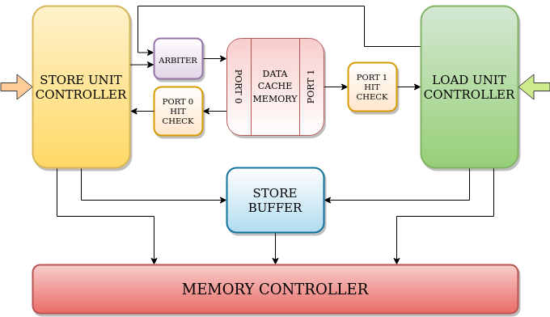
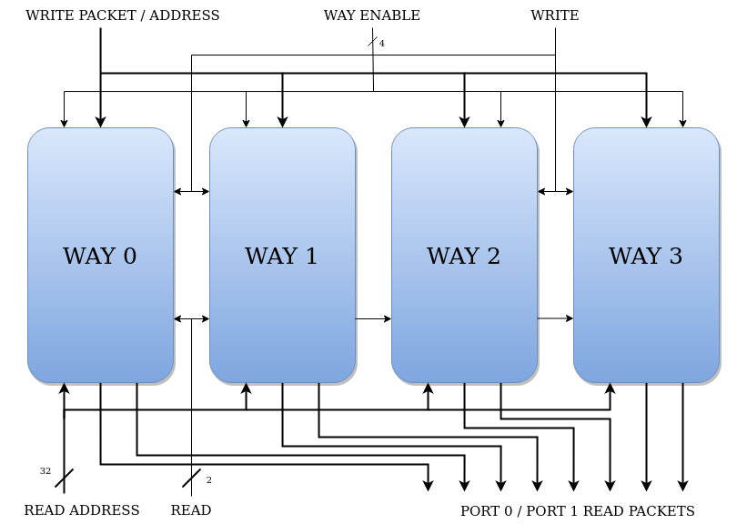
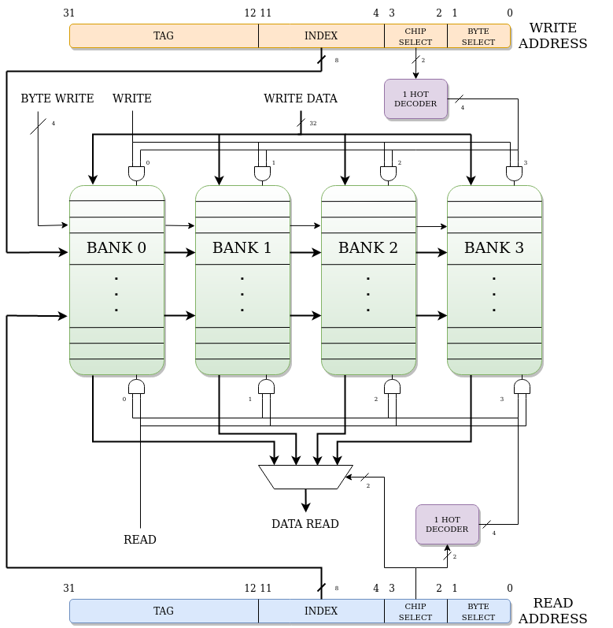

# Data Cache

RV32-Apogeo implements an highly parameterizable data cache to get faster access to memory.

The base parameters are: 

Parameter | Value | 
--- | --- | 
Total size    | 16KB |
Block width   | 128 bits
Associativity | 4 ways

Given that, the address generated by the CPU will have the following values: 

Range | Name | Description |
--- | --- | --- |
[31:12] | Tag         | Used to check the entry against the data in the ways
[11:4]  | Index       | Used to access the actual cache
[3:2]   | Chip select | Used to access one of the N data banks
[1:0]   | Byte select | Used to access a byte (in byte operations)

---

&nbsp;

## Cache Memory 

The cache is not composed only by the memory block. There are also components that control the cache traffic and memory traffic:

* [Store controller](#stor-controller) 
* [Load controller](#load-controller) 
* Cache hit checker
* Port 0 arbiter
* [Cache memory block](#memory-design)

The cache is directly connected to the **Load Store Unit** which resides in the *Execution unit* in the main pipeline, to the **store buffer** and the **memory controller**

&nbsp;

### Memory design 

As said, the cache configuration is 4-way, 16KB with a 128 bit (16 bytes) wide data block. 

Each way has 4KB of data, divided by the block bytes, we find that the total cache entries are 256 (8 bit index).

For *loads miss* the cache has **early restart mode**, which means that as soon the right block requested arrives from external memory it will be supplied to the load unit while the cache line is being allocated. Also **writeback** dirty lines when replacing them.

For *store misses*, the cache simply writes the data directly into memory (**write no allocate**). The cache will write the data into a **store buffer** and the memory controller will take care of it.

The memory has two ports: **PORT 0** is a **R/W** port and it is used mainly by the store unit controller to write data in cache, load unit controller will use this port to allocate a new cache line in case of a load miss. **PORT 0** usage is arbitrated by appropriate arbiter logic. 

**PORT 1** is a **R** only port and it is exclusively used by load unit controller.

Each port has an appropriate hit logic block connected to the controllers.

The cache is composed by **4 ways**, a way is composed by:

* Status bits
* Tag bits
* Data bits

During a cache read, all the ways are accessed at the same time since the 4 tags need to be compared to the CPU address. During a write only one way must be written. This is done thanks to way enable bits.

*PORT 0* **read packets** are composed of: 

* Valid bit
* Tag

Because **store controller** only needs to know if the access is an hit or a miss.

*PORT 1* **read packets** are composed of:

* Valid bit
* Dirty bit
* Tag 
* Data

Because **load controller** needs to know if the access is an hit or a miss and thus if the data is valid or not. Also dirty bit is needed to know if writeback the block during reallocation.

&nbsp;

### Data block 

To lower the energy consumption and access time, the block is divided into 4 different banks 32 bits wide to match **XLEN**, accessed by the [3:2] bits of the address generated by the CPU. By that we add a little bit of decoding logic but lower drastically the memory design complexity.

The block memory has 2 ports: **PORT 0** has only write capabilities (with byte write port), **PORT 1** has only read capabilities.
The reason why **PORT 0** is a write only port is because the store unit doesn't need to read any data.

&nbsp;

### Status and tag 

To know if the cache location accessed corresponds to the address generated, a valid bit and a tag are needed. Both sets of bits are stored in a memory with two ports: **PORT 0** is a **R/W** port, **PORT 1** is **R** only.

On read the tag is compared with the high address bits ([31:12]), the result is anded (&) with the valid bit, this determine if the access is an hit or a miss.

At startup all the cache lines are set as invalid (valid bit = 0).

The dirty bit is used to know if the memory location corresponding to that cache line is up to date or not. If not, during a load miss, before a new line is allocated, the old cache line gets written back into the memory.

---

&nbsp;

## Store Controller

The **store controller** works closely with the **store unit**, his job is to:

* Store data in cache
* Store data in memory
* Invalidate a cache line
* Check store validity

### Cache Store 

During this operation, the controller stores a word in a specific location in the cache. As soon as the store request arrives, the controller sends a **request to take control of PORT 0**, once it's granted, it sends the address to cache, chip select and **read** signal.

If the read is an *hit*, latch the way that had the corresponding address, during this time the **PORT 0** control is released. On miss read: [Memory Store](#memory-store)

Request again **PORT 0**. Once control is granted, send a write signal with a way enable signal based on the way that it hit previously, enable writing data and dirty bit. Dirty bit must be set. Set the byte write enable signal accordingly to the store operation.

### Memory Store

If the read is a *miss* or the data is **not cachable**, that means that the block at that specific address is not in the cache. In this case, there are two possibilities:

If the data that needs to be stored at that address is **bufferable**, just push it in the store buffer, the memory controller will take care of it as soon as possible. This requires just one cycle if the buffer is *not full*.

If the data is **not bufferable** then a memory request is sent. Once the request is acknowledged, the controller will take care of the rest. The latency of this operation depends on the external memory speed.

### Invalidation

In a system composed of the CPU and other components like peripherals or co-processors, an entity can write the external memory. 

The data memory at that address however, can be *different from the data in the CPU cache*. An invalidation request is the solution, the component that needs to write a value in memory will send an invalidation request, the CPU will take the address received, read the cache and: if it's a **miss**, then *no data needs to be invalidated*. If it's an **hit** then the *valid bit at that address will be cleared*.

### Check Validity

RV32-Apogeo is a speculative CPU. During an instruction fetch, if a jump instruction is encountered, the front-end will make a speculative decision. That decision will be resolved later in the execute stage. 

All the speculative instructions are permitted to flow in the pipeline until the reorder buffer. In the *writeback stage*, if an instruction is marked as speculative it will be simply killed. This is because it doesn't change the architectural state.

However this is different for store instructions since they change the cache state (thus architectural stage) before the *writeback stage*.

To overcome this problem the store controller actually waits for the branch to be resolved. If the decision was correct then the store can be executed, otherwise it will be killed.

---

&nbsp;

## Load Unit Controller

The **store controller** works closely with the **load unit**, his job is to:

* Load data from cache
* Writeback cache block
* Allocate new block 

### Cache load hit

During this operation, the controller retrieves a word from the cache and sends it directly to load unit. As soon as a read request arrives, the controller sends the address, chip select, enable signal and a read signal for **PORT 1**. When the cache responds with data, it's checked and an hit / miss signal is sent.

If the access is a miss then the controller [access the memory and allocate a new block](#cache-load-miss). 

If hit just send the data to the **load unit**. 

To reduce hit time and enable coherency, the controller checks if the address is found in the **store buffer** or in the **store controller**.

### Cache load miss

On a miss, the controller sends a *CPU request* to memory and starts immediately reading the cache. An LFSR generates a random number between 0 and 3 to select the random way to replace. Sequentially read that random way cache line, **on the first read check the dirty bit**.

If the block is dirty, then keep reading as it pushes the word into the **store buffer**. Notice that in the standard configuration the store buffer can accommodate an entire cache block. If it's not dirty or the writeback has finished, wait for memory to respond. 

Once the memory supplies new data, start allocating it. Request **PORT 0**, once control is granted, *start writing from address 0*, then increment the chip select field in the address until the end of the line.

If the chip select currently used by the controller matches that of the load unit, declare the data that is being written as valid and send it to the unit. 