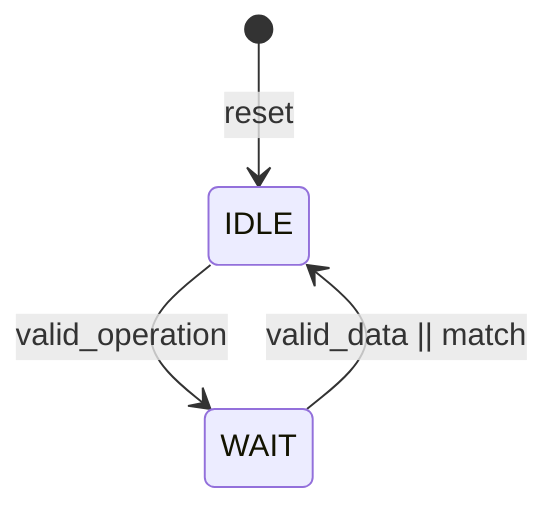
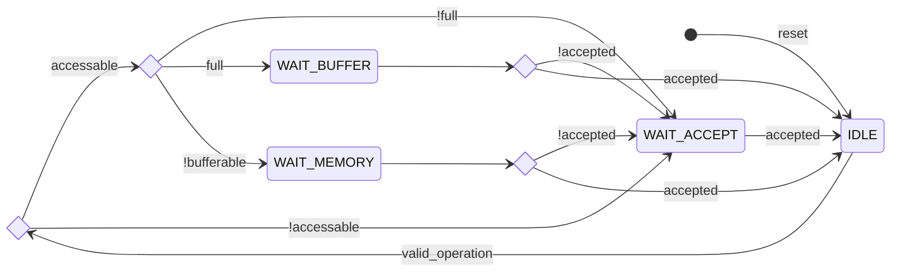

# Execution Unit

## Index 

* [Introduction](#introduction)
* [Operand Fowarding](#operand-fowarding)
* [Integer Unit](#integer-unit)
    * [Arithmetic Logic Unit](#arithmetic-logic-unit)
    * [Multiplication Unit](#multiplication-unit)
    * [Division Unit](#division-unit)
    * [Bit Manipulation Unit](#bit-manipulation-unit)
* [Load Store Unit](#load-store-unit)
    * [Load Unit](#load-unit)
    * [Store Unit](#store-unit)
* [Control Status Register Unit](#control-status-register-unit)

---

&nbsp;

## Introduction

The *execution unit* is the hearth of every CPU, it's the unit that enables the core to do computation on numbers.

In this pipeline stage there are three different main units: 

* **Integer Unit**
* **Load Store Unit**
* **Control Status Register Unit**

Each of these has a general task to accomplish: 

* Integer Unit performs arithmetic and logic computations on *integer numbers*.
* Load Store Unit allows the CPU to access the memory.
* Control Status Registers Unit enable the software to write and read the CPU status.

Those main units also host other sub-units that do different types of operations. Each of those sub-unit can be pipelined, sequential or combinational: 

* **Pipelined** sub-units can accept one operation per cycle and produces a valid result after *N* clock cycles depending on the number of stages.
* **Combinational** sub-units can accept one operation per cycle and produces a valid result immediately.
* **Sequential** sub-units can handle only one operation until they finish their task

The issue stage can issue an instruction to a particular sub-unit by asserting the corresponding bit in the bus. After a unit receives a valid operation to perform, it loads the operands, the valid bit and the instruction packet and carries them until the result shows up. 

* In pipelined units, the valid bit and the instruction packet are carried along the pipeline with a shift register.
* In combinational units, the valid bit and the instruction packet are directly connected with the next pipeline register stage.
* In sequential units, the valid bit and the instruction packet are loaded inside registers and then released when the units produces a valid result.

In order to avoid requiring large multiplexers to select the outputs and big pipeline registers, *all the outputs are 0 until a valid result is produced*. Having 0 on all outputs when the result is not valid enables OR-ing all the outputs to produce a single valid signal for each main unit Having 0 on all outputs when the result is not valid enables **OR-ing** all the outputs to produce a single valid signal for each *main unit*. This **requires one single valid result per clock cycles**, otherwise the result will be corrupted, the scheduler will ensure this.

The **instruction packet** carries information of the current operation executed along with the pipeline. It's necessary to support **precise interrupts and exceptions** because of the out of order execution. The packet fields are: 

Field width   | Name                 | Description |
---    | ---                  | ---         |
5  | Register destination | Register destination address for fowarding and write back.  |
6  | Reorder buffer tag | Used to address the reorder buffer during commit stage. |
32 | Instruction address | Used in case of interrupt / exception to save the program counter of the interrupting instruction. |
5  | Trap vector | Describes the cause of the trap |
1  | Trap generated | A trap has been generated and the trap vector is valid | 

&nbsp;

All units *receive the two operands, a valid bit and a shared set of bits that rapresent the operation to execute*. The valid bit activate the execution of the operands, each unit has its own valid bit. The operands and the operation bits are shared between all the units. The operation bits are interpreted differently by each unit.

---

&nbsp;

&nbsp;

## Operand Fowarding

Operand fowarding is the first stage of the execution unit, it takes the operands from the *issue stage* and from the physical registers of the *commit stage* and *reorder buffer*. This component is used to clear the RAW (Read After Write) dependencies caused by the pipelined design. This will grant a nice performance gain since the instruction doesn't need to wait until the result is written back.

* If one of the operands of the instruction currently in the *issue stage* match the register destination of an instruction that is passed into the *commit stage*, the matching operand is swapped with the result of the instruction in the commit stage. 

* If one of the operands of the instruction currently in the *issue stage* match a valid physical register in the commit stage, the matching operand is swapped with the result of the instruction in the commit stage.

* If one of the operands of the instruction currently in the *issue stage* match a valid physical register in the reorder buffer, the matching operand is swapped with the result of the instruction in the commit stage.

*The physical registers are copies of the main register file updated to the most recent instruction*. Every time an instruction is pushed into the commit buffer or into the reorder buffer, its result get written into the physical register file and the associated register gets validated. Once the instruction passes into the next stage, the destination register gets invalidated. During fowarding, if there are multiple matches, the most recent source has the priority. So from highest to lowest priority: ISSUE, COMMIT, ROB

One property of the execution pipeline that **must be satisfied** is: *two or more instructions that have equals register destination cannot be at the same time in the pipeline*. This is because instructions can surpass each other, this example will show this **WAW (Write After Write) hazard**: 

```
...
ADD X4, X5, X3      // X3 = X4 + X5
DIV X1, X2, X3      // X3 = X1 / X2 
MUL X3, X6, X9      // X9 = X3 * X6
...
```

Consider that the *DIV* operation completes in 34 cycles while the *ADD* instruction in 1 single cycle. Once both have been issued to the execute stage, the *MUL* instruction will be in the issue stage waiting. The *MUL* expects the result from the *DIV* instruction but *ADD* will finish first and it's result will be fowarded: the multiplication instruction will get the wrong result.

By making sure that no matching destination registers are present in the execution stage, the *WAW hazard* will be eliminated completely. Even if the above code is not useful and compilers could easily eliminate this issue by removing the *ADD* instructions, hardware support should always be offered since the target compiler is not known.

The only exception to this rule is if the register X0 is in the pipeline.

---

&nbsp;

&nbsp;

## Integer Unit

The integer unit is where all the arithmetic and logic operation on integer numbers are done, branches are also resolved here. It's composed by four different sub-units: 

* Arithmetic Logic Unit (ALU)
* Multiplication Unit (MUL)
* Division Unit (DIV)
* Bit Manipulation Unit (BMU)

---

&nbsp;

### Arithmetic Logic Unit

This is the unit where all of the arithmetic and logic instructions of RISCV base ISA are executed. Branches here are resolved and the outcome is sent to the **branch prediction unit** and the **system controller**. It's a completely combinational unit, so the result is immediately valid, because of this if no hazard is detected, an instruction after an ALU instruction can be issued without waiting any clock cycle as soon as the result of the ALU instruction goes into the commit stage.

Because of this property, no instruction can surpass a previous ALU instruction (in an out of order machine, instructions can surpass each other), so this means that after the issue stage **no instruction will be speculative**. If the branch was mispredicted, every instruction before the execute stage is killed.

&nbsp;

### Multiplication Unit 

In this unit, multiplications are performed according to the RISCV **M-extension**, it takes as input two 32 bits number, and output one single 32 bit number. Since a 32 $\times$ 32 multiplication produces a 64 bit number, the output is only one of the halves of the full number (it can be the upper or lower half). 

The inputs number can be considered both as **signed** or **unsigned** based on the operation to perform. Because the core multiplier works on unsigned numbers, in case of signed numbers, the **absolute value** needs to be computed by executing the *two-complement*. 

When the result is produced, it's brought back to the signed magnitude if the operation requires signed operands, that is: if one of the inputs was negative, the output will be negative too and needs to be two-complemented.

The unit is fully pipelined so it can accept a new operand every clock cycle.

&nbsp;

### Division Unit

In this unit, divisions are performed according to the RISCV **M-extension**, the result can be the quotient of the division as well as the remainder. As the *multiplication unit*, the inputs can be considered as **signed** or **unsigned** and because the core divider works on unsigned numbers, if the operation requires signed numbers, the **absolute value** needs to be computed by executing the *two-complement*.  

When the result is produced, it's brought back to the signed magnitude, that is: if one of the inputs was negative, the output will be negative too and needs to be two-complemented.

The unit is **sequential**, so it can't accept new operation until the current one finishes.

&nbsp;

### Bit Manipulation Unit

This unit implements the RISCV **B-extension** (Zba and Zbb only), here bit operations like bit counts, bit set and clear, byte reverse etc. are performed on the two 32 bits operands. 

The unit is **fully pipelined** so it can accept a new operand every clock cycle.

---

&nbsp;

&nbsp;

## Load Store Unit

All the memory instructions (load and stores) get executed inside the load store unit. The unit is composed by two dedicated sub-units: 

* Load Unit for issuing load requests
* Store Unit for issuing store requests

Inside the unit there is also the memory mapped CSR **time** that can be easily accessed by the sub-units. Accessing the timer is no different than accessing an I/O device in the main memory.

Load and stores are executed on words of 32 bits as the RISCV specification indicates, however, subsequent stores can be detected and fused together to form a single burst store. 

If the cache 

&nbsp;

### Load Unit

The load unit is resposable for issuing load requests to the memory controller and elaborating the data received from the memory based on the instruction. There are five types of load, three unsigned and two signed, in general it's possible to load a single byte, an halfword or a full word from the memory. 

The unit is implemented as an FSM, thus it can accept one instruction only if it's idle, otherwise the instruction needs to wait.

The following diagram shows the states that the load unit goes through during a request to memory unit.



Name   | Description                 | Next State | Condition |
---    | ---                         | ---        | ---       |
IDLE   | Waits until a valid operation is received. After reset this state is reached | WAIT | If the operation is valid <br /> 
WAIT   | Waits until valid data is supplied. The data is then elaborated based on the operation to perform | IDLE | If data is valid or a match is found in store buffer or store unit

As seen in the FSM description, the data can be supplied in multiple ways, from the higher to lower priority: 

* **Store Unit Match**: The store unit is currently storing data (executing an older instruction), if the addresses match, the data is then fowarded.
* **Store Buffer Match**: The store buffer is holding a valid store instruction where the target address match the load address, the data is then fowarded.
* **Memory Controller**: Data is normally supplied by the memory controller that has accessed the main memory.


Additional states are needed if the *cache is implemented*: 

// ADD STATES

&nbsp;

### Store Unit 

The store unit is resposable for issuing load requests to the memory controller. There are three types of stores for different store width: byte, halfword and word.

The unit usually access the store buffer and then go idle, this will improve performance since *there's no need to wait for the memory to complete the store*, once the operation is pushed into the buffer, a new instruction can be executed. The store buffer delegate the store operation completely to the memory controller (see [this](#store-buffer) for more informations). 

If the buffer is full, the unit must wait until the memory controller pull an operation from the fifo and then push it's operation. 

If the memory address belongs to a **non bufferable** memory region, the unit start a communication directly with the memory controller without pushing an operation to the buffer, then waits until completition.

Loads have priority over stores since they create RAW dependencies, because of this is the load unit and the store unit produce a valid result in the same clock cycle, the load unit result get accepted first while the store unit waits until the arbiter.



Name   | Description                 | Next State | Condition |
---    | ---                         | ---        | ---       |
IDLE   | Waits until a valid operation is received. After reset this state is reached | WAIT_ACCEPT <br /> <br /> WAIT_BUFFER <br /> WAIT_MEMORY <br />| If the memory address belongs to a non writable memory region <br /><br />  If the store buffer is full <br /> If the memory address belongs to a non bufferable memory region | 
WAIT_BUFFER | Waits until the buffer is not full, then push an operation | WAIT_ACCEPT | If the operation is not immediately accepted | 
WAIT_MEMORY | Waits until the memory controller completes the store | WAIT_ACCEPT | If the operation is not immediately accepted | 
WAIT_ACCEPT | Waits until the arbiter accept the operation | IDLE | If the operation gets accepted from the arbiter

Additional states are needed if the *cache is implemented*: 

// ADD STATES