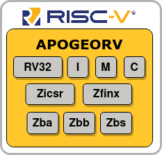

# ApogeoRV RISC-V 32 bit CPU

  

## Overview 

ApogeoRV is an **high performance highly customizable** CPU implementing the **RISC-V** instruction set architecture. This core is intended to be used in bigger designs as a main scalar processor, ApogeoRV delivers exceptional performance with a reduced area and power consumptions thanks to the RISC-V ISA and to microarchitectural choices. This project wants to deliver an *easy setup* CPU thanks to the essential and intuitive external interface. Thanks to it's high parameters configurability that ranges from ISA extensions to CPU structure sizes, the system designer can explore different area / power / performance tradeoffs.

The target systems are mainly FPGAs infact this CPU was entirely built and verified using *Xilinx Vivado*, but with some changes in the RTL code, it's possible to target ASICs. 

Online documentation [here](https://rv32-apogeo.readthedocs.io/en/latest/) 

## Key Features

* Supports the RISC-V base ISA: `I`
* Supports the RISCV extensions: `M`, `C`, `Zicsr`, `Zfinx`, `Zba`, `Zbs`
* Supports part of the RISCV `Zbb` extension.
* Supports *machine* `M` and *user* `U` privilege modes.
* Out Of Order Execution (In order issue and writeback)
* Branch predictions (GSHARE + BTB)
* Store Buffer with load fowarding
* Support variable latency memory accesses
* Instruction prefetch enabled by the Instruction Buffer
* Disable execution units from software to reduce power consumption

As said ApogeoRV is highly configurable, here's the *list of all possible parameters* that the designed can modify:

* Async or Sync hardware reset
* Instruction Buffer size 
* Branch Predictor Table size
* Branch Target Buffer size
* Store Buffer size 
* B extension enabled 
* Zfinx extension enabled 
* Branch Predictor enabled
* Multiplier latency

Adjusting these parameters can significantly alter the area, power, and maximum frequency.