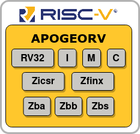

# ApogeoRV RISC-V 32-bit CPU

  

ApogeoRV is a configurable, synthesizable 32-bit RISC-V core. It combines a
speculative frontend, out-of-order execution, in-order retirement, a store
buffer, and optional integer bit-manipulation and floating-point units.

The core is designed to be integrated into a larger SoC. Its top-level RTL is
hw/ApogeoRV.sv, while the complete source order is described by
hw/_apogeoRV.f. The detailed technical manual is in doc/sphinx/ and the
documentation build instructions are below.

## Current architecture

The checked-in configuration enables:

* RV32I with M, C, Zicsr, Zba, Zbs, and Zfinx support;
* the bit-manipulation unit and instruction tracing;
* a 1024-entry GShare predictor and 1024-entry BTB;
* an eight-entry instruction buffer and four-entry top-level store buffer;
* a 32-entry reorder buffer; and
* a two-stage integer multiplier.

The FPU implements single-precision add, subtract, multiply, comparisons,
min/max, conversions, classification, and sign-injection operations. It does
not implement floating-point division, square root, or fused multiply-add
instructions. See doc/sphinx/microarchitecture/fpu.rst for the exact current
operation set and timing.

## Documentation

Install the documentation dependencies:

    python3 -m pip install -r doc/sphinx/requirements.txt

Build the HTML manual:

    make -C doc/sphinx html

Build it strictly, treating warnings as errors:

    make -C doc/sphinx clean
    make -C doc/sphinx SPHINXOPTS=-W html

The generated site is written to doc/sphinx/_build/html/index.html. Start
reading at doc/sphinx/architecture/introduction.rst. The practical
microarchitecture guide is doc/sphinx/microarchitecture/frontend.rst and
doc/sphinx/microarchitecture/backend.rst.

## Simulation and integration

ApogeoRV does not ship with a standalone top-level Makefile for compiling the
RTL. The core is normally compiled through the consuming SoC's file list and
testbench. In the ZenithSoC parent repository, use:

    source setenv.sh
    make -C sw/benchmark/CoreMark sim
    make -C tb/verilator run \
        DDR=../../sw/benchmark/CoreMark/out/coremark_sim.elf \
        BOOT=../../sw/benchmark/CoreMark/out/boot_rom.elf

For CPU and memory-system lockstep:

    source setenv.sh
    make -C cosim run-notrace SEED=0 N=2000

The core's directed programs are under sw/test/ and the benchmark programs
are under sw/benchmark/. Several older compile.sh scripts still refer to the
original FPGA project layout; use the parent ZenithSoC flows for current
regression and integration testing.

## Source map

* hw/front_end/ — fetch, prediction, decompression, decode, scheduling, and
  halt control.
* hw/back_end/ — execution units, commit buffers, reorder buffer, traps, and
  writeback.
* hw/inc/ — configuration headers, packages, interfaces, memory map, and
  exception vectors.
* doc/sphinx/ — the human-readable architecture and integration manual.
* sim/ and tb/ — focused models, directed tests, and testbench support.

When the prose and RTL disagree, follow the RTL and update the relevant
documentation page in the same change.

## License

ApogeoRV is distributed under the MIT License. See LICENSE and the legal page
in doc/sphinx/legal/license.rst.
