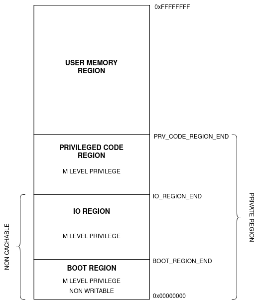

General architecture
====================

ApogeoRV is a RISC-V core with a speculative frontend and an out-of-order
backend. The implementation is deliberately modular: interfaces and packages
under **hw/inc/** define the contract, while the frontend and backend can be
configured through the header in **hw/inc/headers/**.

Instruction set profile
-----------------------

The core starts from RV32I and adds the extensions selected in the hardware
configuration:

* **M** supplies integer multiplication and division;
* **C** supplies 16-bit compressed instructions;
* **Zicsr** supplies CSR access;
* **Zba** and **Zbs**, together with the implemented bit-manipulation decoder,
  supply address-generation and single-bit operations; and
* **Zfinx** supplies single-precision floating point through the integer
  register file.

The current FPU is a useful single-precision subset, not a complete
implementation of every F extension instruction. Its exact boundary is
documented in the FPU page.

Privilege and traps
-------------------

ApogeoRV implements machine mode and user mode. Loads and stores to the
private region are restricted to machine mode; the user region is accessible
from both modes. Exceptions are carried with the instruction packet and are
handled at writeback, which keeps traps precise even when execution completes
out of order.

The interrupt controller is outside the core. The top level accepts general,
timer, and non-maskable interrupt inputs, plus an eight-bit interrupt vector.
The core acknowledges an accepted interrupt for one cycle. See the interrupts
page and the external-interface page for the signal-level behavior.

Pipeline overview
-----------------

The implementation splits the traditional fetch/decode/execute/writeback
cycle into smaller stages:

**PC generation**
   Selects the next address from sequential flow, a BTB prediction, a resolved
   branch, a trap target, or a handler return.

**Fetch**
   Reads aligned 32-bit words from the instruction buffer. The C extension
   means that the next instruction may occupy either halfword or cross a word
   boundary, so fetch maintains a small amount of stream state.

**Decode**
   Converts the instruction into immediates, register addresses, extension
   controls, exception information, and a one-hot execution-unit selection.

**Issue**
   The scoreboard checks data, structural, and result-timing hazards. The
   scheduler reads the register file or forwards a just-written value, then
   creates the instruction packet.

**Execute**
   Integer, bit-manipulation, load/store, CSR, and floating-point units run
   according to the packet. Branches and memory addresses are resolved here.

**Commit and reorder**
   Commit buffers absorb concurrent execution results. The ROB accepts them
   through one write path and makes them available to writeback in program
   order.

**Writeback**
   A valid ROB head updates the architectural register file or commits a
   store. Exceptions and interrupts flush speculative state before the next
   handler instruction is fetched.

Memory map
----------

The default map is defined in
**hw/inc/headers/apogeo_memory_map.svh**. The boundaries are compile-time
macros, so an integrator can adapt the map to the surrounding SoC.

.. list-table:: Default memory regions
   :header-rows: 1
   :widths: 28 24 24

   * - Region
     - Address range
     - Access
   * - Boot
     - 0x0000_0000 - 0x0000_3FFF
     - Machine mode, non-cacheable
   * - I/O
     - 0x0000_4000 - 0x0800_3FFF
     - Machine mode, non-cacheable
   * - Private
     - 0x0000_0000 - 0x7FFF_FFFF
     - Machine mode
   * - User
     - 0x8000_0000 - 0xFFFF_FFFF
     - User and machine mode

The boot region is the reset entry point. The core does not implement a timer
device or an interrupt controller; those are system-level peripherals mapped
through the external load and store interfaces.

Recent implementation direction
-------------------------------

The current RTL differs in important ways from the first documentation
revision:

* ROB allocation is now owned by the ROB rather than by the scheduler;
* the fetch stage has an explicit state machine for compressed and cross-word
  instructions;
* BTB validity, GShare prediction, and prediction FIFO alignment are handled
  independently;
* the former sleep behavior is represented by a halt-and-drain unit that can
  service an interrupt; and
* the FPU now includes subnormal handling, gradual underflow, and retimed
  rounding paths.

These changes are explained in the microarchitecture pages instead of being
hidden in a long list of module names.
