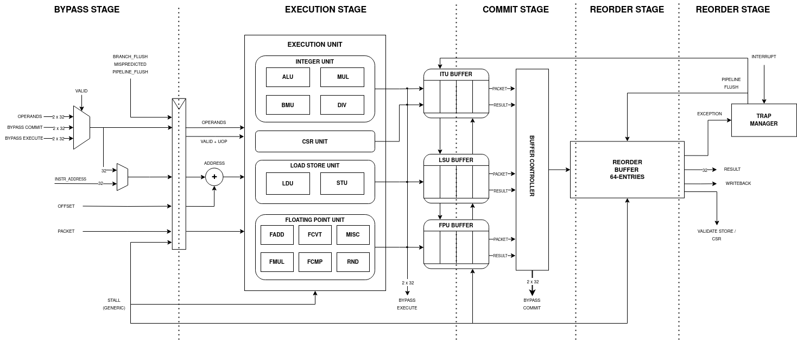
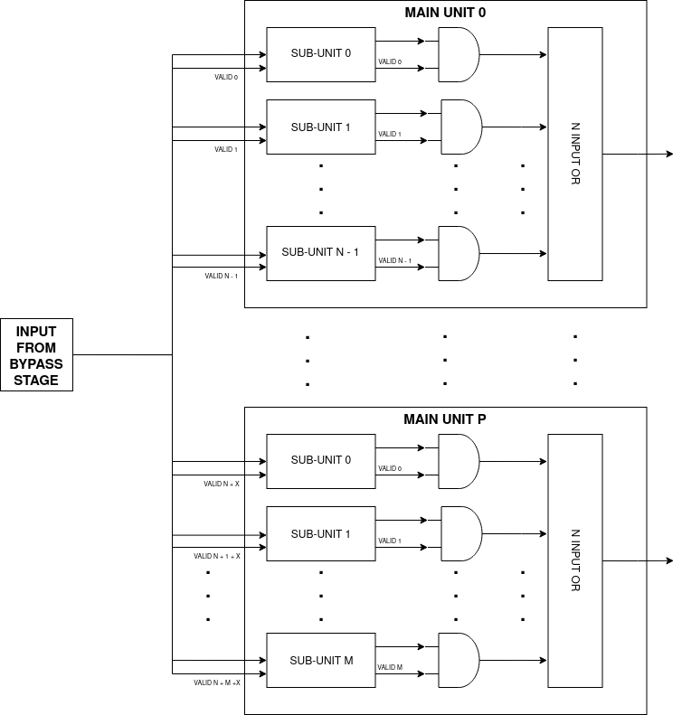
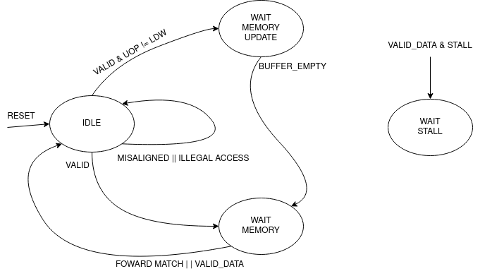
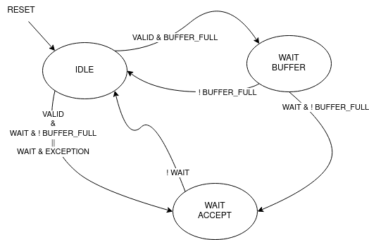

Backend
=======

The backend is where decoded instructions become results. It receives an
instruction packet from the frontend, forwards the newest available operands,
executes the selected unit, buffers concurrent completions, and finally
retires the packet through the reorder buffer.

The important distinction is between **execution order** and **architectural
order**. Independent instructions can execute and complete out of order. The
register file, stores, traps, and interrupts are updated only when the
corresponding packet reaches the head of the ROB.

Bypass
------

The bypass controller avoids waiting for every result to reach the register
file. For each source operand it selects, in priority order:

1. a valid result from the execute stage;
2. a valid result from a commit buffer; or
3. the value read by the scheduler from the register file.

Immediate operands bypass this comparison because they cannot depend on a
pending register result. The earlier source has priority because it carries
the newer value in the pipeline.

Scoreboard and issue
--------------------

The scoreboard tracks the state of each execution resource. For an in-flight
operation it records:

* the destination register;
* whether the resource is executing;
* the remaining latency for a result; and
* the availability of variable-latency load/store units.

It checks read-after-write hazards against all active functional-unit slots,
structural hazards for non-pipelined resources, and result-timing hazards that
would make two units produce a result at the same time. Pipelined units are
represented as virtual slots, one for each stage of their configured latency.

ROB and scheduler: the current contract
----------------------------------------

The ROB is now the owner of allocation state. This is the important
architectural change from the older implementation.

The scheduler receives:

* **rob_tag_i**, the tag for the next free entry; and
* **rob_full_i**, the ROB capacity indication.

When the instruction has no scoreboard or structural hazard, the scheduler
asserts **rob_alloc_o**. The ROB advances its allocation pointer only in
response to this event. The scheduler therefore attaches a tag to the packet,
but it no longer owns or updates the tag sequence.

This arrangement keeps the capacity decision next to the state that owns the
free-entry count. It also removes ambiguity when a stall, flush, or branch
recovery happens at the same time as a potential allocation.

The allocation and retirement sides of the ROB are independent:

* allocation uses the next free tag and stores the instruction PC;
* execution results write a packet into the physical entry and set its valid
  bit;
* writeback retires only the valid entry at the read pointer; and
* retirement advances the read pointer and invalidates that entry.

The current default ROB depth is 32 entries.

Execution units
---------------

The execution stage has three logical ports in the FPU-enabled configuration:

* **ITU** handles integer arithmetic, branches, multiplication, division, and
  bit manipulation;
* **LSU** handles loads, stores, the store buffer, and memory ordering; and
* **FPU** handles the Zfinx floating-point subset.

The CSR unit is integrated alongside these units. It serializes CSR accesses
until the instruction completes, because CSR state is architectural state and
must not be changed by a younger speculative instruction.

The scoreboard constants in the current source are:

.. list-table:: Current issue timing constants
   :header-rows: 1
   :widths: 24 20

   * - Resource
     - Scoreboard latency
   * - ALU
     - 2
   * - Integer multiply
     - 3
   * - Integer divide
     - 37
   * - Bit manipulation
     - 3
   * - FADD
     - 7
   * - FMUL
     - 7
   * - FCVT
     - 4
   * - FCMP
     - 3
   * - FMIN/FMAX and sign/classification operations
     - 3

The constants include the pipeline offset used by the scoreboard. The FPU
page describes the floating-point pipeline itself.

Load/store ordering
-------------------

The load/store unit has variable latency and therefore cannot be represented
only by a fixed countdown. The scheduler uses the LDU and STU idle signals
alongside the scoreboard state.

Stores first enter the store buffer. The buffer can forward a matching recent
store to a younger load, but a store is validated only when its instruction
retires. This prevents an instruction that is later flushed by a trap or
interrupt from changing memory.

The external load and store channels are non-pipelined at the core boundary:
the memory system must complete a request before the next request of that type
can begin. The protocol is described in
../integration/external_interface.rst.

Commit buffers
--------------

Multiple execution units may complete in one cycle, while the ROB has one
write path. Commit buffers absorb this mismatch:

* the ITU, LSU, and FPU each have a result buffer in the FPU-enabled build;
* results can be pushed into their buffers independently;
* a round-robin controller selects one result for the ROB; and
* the buffer's forwarding memory makes a recent result visible to issue.

The buffers are flushed with the pipeline. Their forwarding entries are
invalidated when a newer result for the same architectural register is
accepted, so a stale completion cannot win a later bypass comparison.

Branch recovery
---------------

The backend resolves the branch outcome and target after bypassing. A
misprediction flushes younger frontend work and sends the resolved branch tag
to the ROB. The ROB then sets its allocation pointer to branch_tag + 1,
discarding younger speculative allocations while keeping the branch and older
instructions available for retirement.

The ROB records the PC at allocation time in a parallel allocated-PC memory.
That saved PC is used to select a precise resume point when an interrupt
arrives while instructions are still in flight.

Writeback and precise state
---------------------------

Writeback examines the ROB head. If the entry is valid, it either:

* writes an integer or floating-point result through the integer register file;
* validates a committed store;
* updates the CSR state at the correct architectural point; or
* raises a trap and flushes the pipeline.

Exceptions are not acted on when an execution unit first detects them. They
travel with the packet until the packet reaches the ROB head. This is what
makes the out-of-order engine precise.

An interrupt uses the same precise resume machinery. The ROB head PC is used
when available; otherwise the last retired PC is used. The trap manager
flushes younger work, acknowledges the interrupt, and allows the handler to
enter through the frontend.

Pipeline empty and halt
-----------------------

The backend reports empty only when the ROB, commit buffers, and store buffer
are empty. The frontend combines this with its own instruction-buffer and
decode state before the halt unit enters HALT. See the frontend page for the
interruptible drain state machine.

Backend source pointers
-----------------------

The main implementation files are:

* hw/front_end/scoreboard.sv;
* hw/front_end/scheduler.sv;
* hw/back_end/bypass_controller.sv;
* hw/back_end/execution_unit.sv;
* hw/back_end/commit_stage.sv;
* hw/back_end/reorder_buffer.sv;
* hw/back_end/trap_manager.sv; and
* hw/back_end/writeback_stage.sv.
