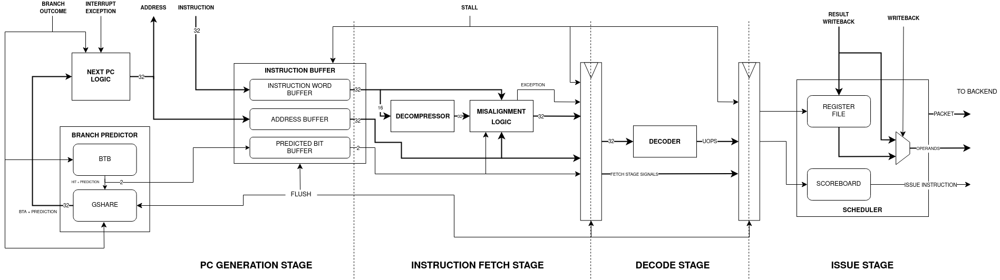
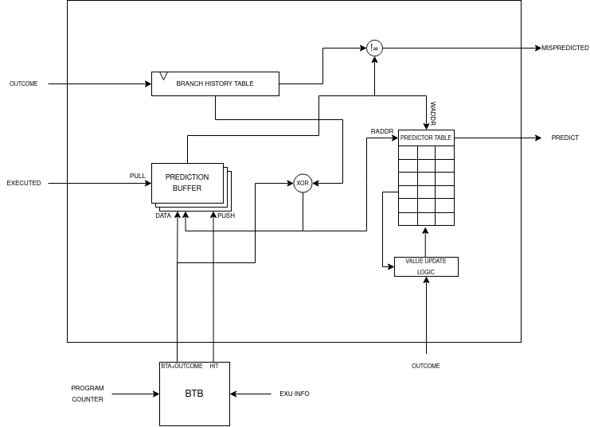

Frontend
========

The frontend keeps the backend supplied with decoded work. It has to solve
three problems at once: fetch ahead of the execution pipeline, predict the
next PC, and turn a stream of 16-bit and 32-bit instructions into one
instruction packet at a time.

The path through the frontend is:

.. code-block:: text

   PC generation
       -> BTB and GShare prediction
       -> instruction buffer
       -> compressed fetch
       -> decompressor
       -> decoder
       -> scoreboard and scheduler

PC logic
------------

The next fetch address is selected by event priority. The important cases are:

1. an exception or interrupt redirects to the handler;
2. MRET redirects to the saved return PC;
3. a resolved branch or jump redirects to its architectural target;
4. a misprediction redirects to the resolved target or to the next
   sequential instruction; and
5. an eligible BTB prediction redirects speculative fetch.

When none of these events fires, the PC advances according to the width of
the instruction being consumed. A full instruction advances by four bytes;
a compressed instruction advances by two. A redirect also invalidates
instructions already in flight so that an old-path response cannot reach
decode.

The fetch interface deliberately allows memory latency to vary. Requests are
placed into the instruction buffer while the rest of the frontend or backend
is stalled. The invalidate signal must cancel both buffered entries and
outstanding responses in the memory system.

Branch prediction
-----------------

Prediction is split between a branch target buffer and a GShare pattern
predictor.

Branch target buffer
~~~~~~~~~~~~~~~~~~~~

The BTB is a synchronous, direct-mapped table. An entry contains:

* a valid bit;
* a tag derived from the branch PC;
* the target address; and
* a bit identifying an unconditional jump.

Taken conditional branches and jumps update the BTB when they resolve. A BTB
hit provides the target and marks the instruction as eligible for prediction.
The index uses PC bits [N:1] when the C extension is enabled and [N+1:2]
otherwise, where N is determined by the table size. This keeps halfword
alignment in the lookup.

GShare pattern predictor
~~~~~~~~~~~~~~~~~~~~~~~~

The pattern table stores two-bit saturating counters. Its index is the XOR of
the global branch history and PC bits; with C enabled, the hash uses the
halfword-aligned PC slice. Counters start weakly taken and are updated when a
conditional branch resolves.

An eight-entry FIFO carries prediction metadata from fetch to execution. Each
record contains the predicted outcome, the hashed table index, and the
predicted target. The FIFO is populated for every eligible BTB prediction,
including a not-taken prediction. That detail is important: the resolution
stage must consume exactly the same sequence of prediction-valid records that
the frontend produced.

Unconditional jumps are forced taken by their BTB entry. They are checked for
target mismatches but do not update conditional branch history or the pattern
table. A conditional branch is mispredicted when its outcome differs from the
record or when a taken prediction has the wrong resolved target.

Prediction validity is kept separate from the branch outcome. A BTB response
for a compressed instruction starting at PC[1] is not redirected
speculatively, because the aligned word containing the continuation is needed
before the fetch stream can be advanced safely.

Instruction buffer
------------------

The instruction buffer decouples memory response timing from pipeline timing.
It maintains three aligned streams:

* fetched addresses;
* speculative and taken metadata from the predictor; and
* fetched 32-bit instruction words.

The default buffer holds eight entries. A flush resets all pointers and
discards delayed responses. This is why a memory system may return a word
after a branch redirect without accidentally reintroducing wrong-path work.

Compressed fetch
----------------

The memory interface returns naturally aligned 32-bit words, while RV32C
instructions are 16-bit aligned. The fetch stage therefore treats consuming an
instruction and popping an instruction-buffer word as separate actions.

The current implementation uses four explicit states:

**STREAM_START**
   Chooses the first useful halfword after reset or a redirect. If PC[1] is
   set, the upper half of the aligned word is the first instruction.

**LOWER_HALF**
   Inspects the lower halfword of the current word. A compressed instruction
   can be emitted while the upper half remains available.

**UPPER_HALF**
   Inspects the upper halfword. Two compressed instructions can therefore be
   emitted from one fetched word without popping the word twice.

**CROSSWORD**
   Completes a 32-bit instruction whose lower or upper half was saved from the
   previous word.

The cases encountered in a word are:

* one full-width instruction;
* two compressed instructions;
* a compressed instruction followed by the lower half of a full instruction;
* the upper half of a full instruction followed by a compressed instruction;
  and
* two halfwords belonging to full-width instructions.

Flushes return the state machine to STREAM_START and clear the saved halfword,
PC, and prediction metadata. Decode receives a normalized 32-bit instruction
plus a compressed flag, so later stages can still calculate the correct
two-byte PC increment.

Decompression and decode
------------------------

The decompressor expands a valid 16-bit C instruction into the corresponding
32-bit instruction before it reaches the ordinary decoder. Illegal encodings
are reported as instruction exceptions.

The decoder then produces:

* immediate values and their valid bits;
* source and destination register addresses;
* branch, jump, fence, and link controls;
* the selected execution unit and micro-operation;
* extension enable information; and
* exception metadata.

The scheduler consumes this packet after the decode stage. It reads the
current ROB tag and full indication from the ROB and returns an allocation
request when the instruction can be accepted. The ROB, not the scheduler,
owns the allocation pointer.

Halt and draining
-----------------

The top-level core uses a four-state halt unit:

**RUN**
   Normal frontend operation.

**DRAIN**
   New frontend work is blocked while the pipeline-empty indication is
   awaited.

**HALT**
   The core is fully drained and halted. Releasing halt returns it to RUN.

**ISR_SERVICE**
   An interrupt temporarily resumes execution. After MRET, the unit returns
   to DRAIN if halt is still asserted, otherwise it returns to RUN.

An interrupt can pre-empt both DRAIN and HALT. The drain condition includes
frontend state, backend execution units, commit buffers, the ROB, and store
buffer activity; the request therefore does not strand partially completed
work.

Frontend source pointers
------------------------

The main implementation files are:

* hw/front_end/front_end.sv;
* hw/front_end/branch_predictor.sv;
* hw/front_end/branch_predictor/branch_target_buffer.sv;
* hw/front_end/branch_predictor/predictor_unit.sv;
* hw/front_end/instruction_buffer.sv;
* hw/front_end/decoder/decompressor.sv;
* hw/front_end/decoder.sv;
* hw/front_end/scheduler.sv; and
* hw/front_end/halt_unit.sv.
